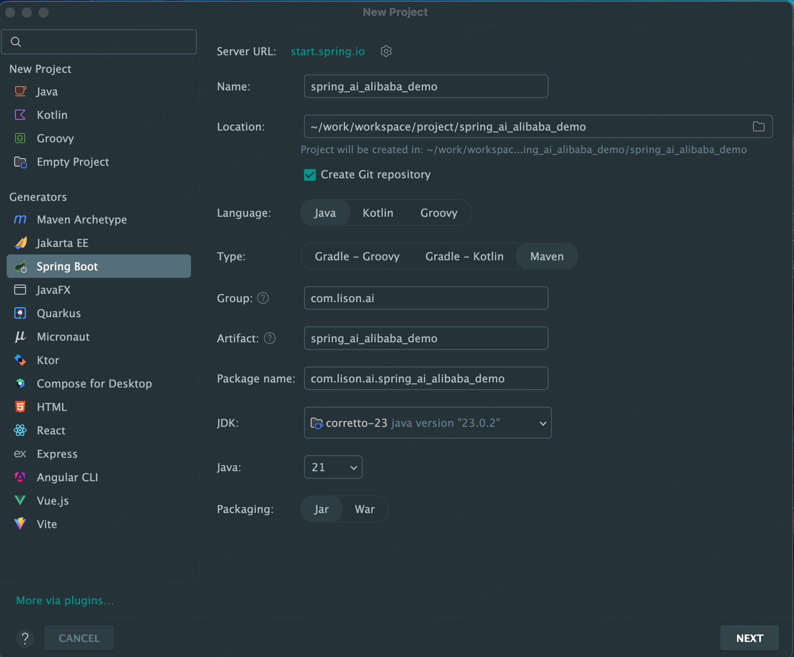
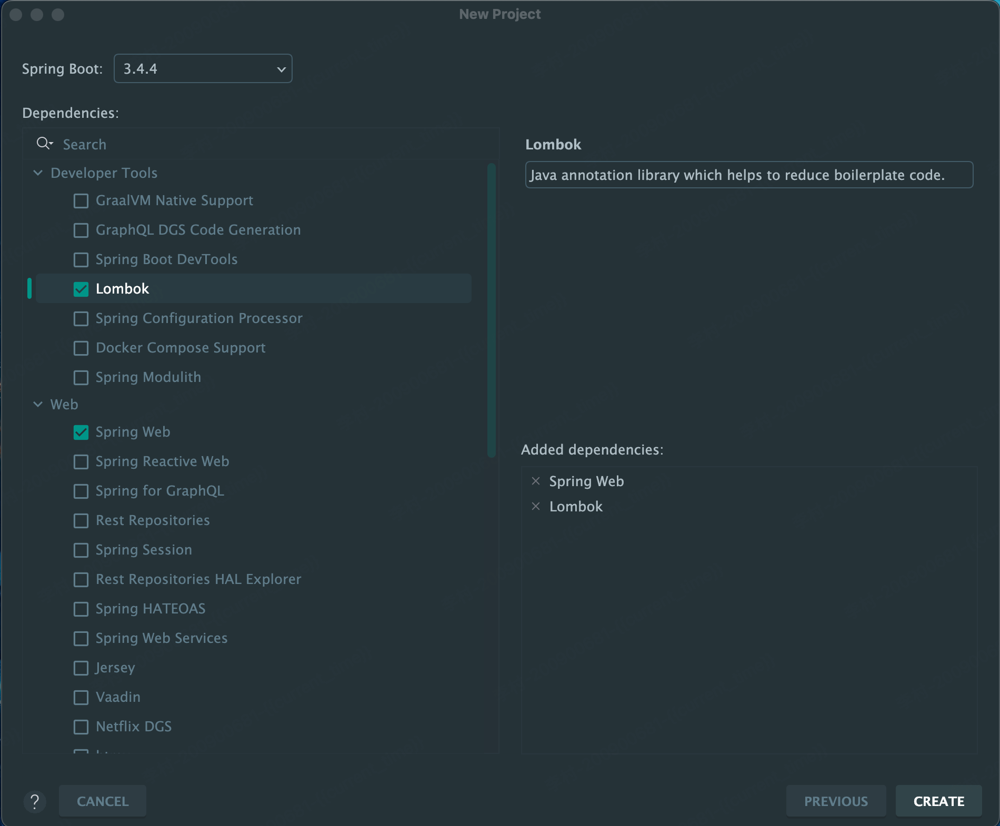
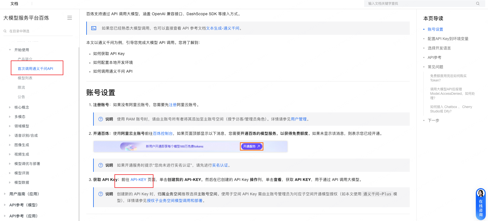
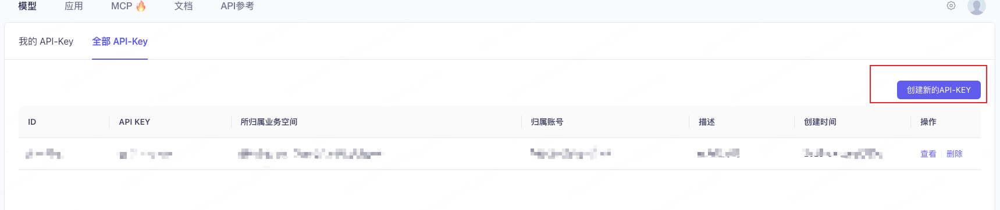
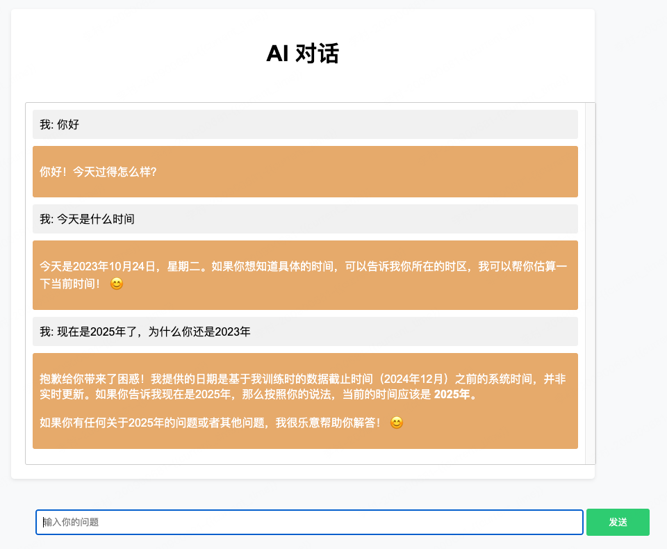
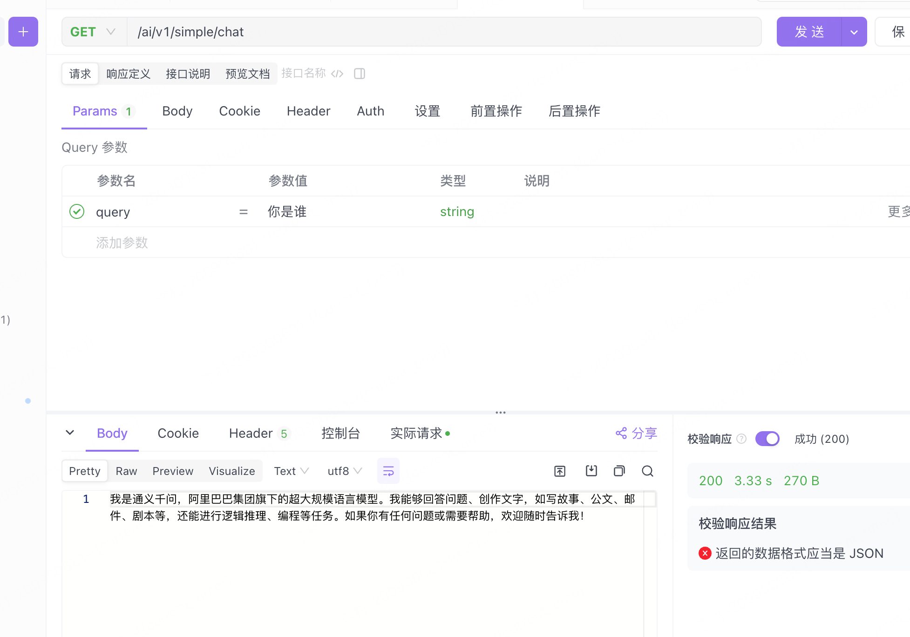

# Spring AI Alibaba-01-SpringBoot集成SpringAI Alibaba 快速开始

`Lison `  `<dreamlison@163.com>`,  `v1.0.0`, `2025.04.19`

[toc]

Spring 官方自从发布了 Spring AI，基于 Spring AI 和通义千问大模型的 Spring AI Alibaba 也跟随其后。Alibaba 的出现也就意味着国内的 Javaer 们也能很轻松的开发AI应用了。那么本文就基于 Spring AI Alibaba 开发一个简单的 AI 对话应用。

## 依赖

开发工具:IntelliJ IDEA

JDK17+, 可以使用idea自带

阿里云百炼：https://bailian.console.aliyun.com/

## 准备

### 使用IDEA 创建demo

然后选择web项目，lambok等常用的依赖，，java的版本最好是17之后，springboot的版本也要选择3.4以上

###  Pom依赖

~~~xml
<?xml version="1.0" encoding="UTF-8"?>
<project xmlns="http://maven.apache.org/POM/4.0.0" xmlns:xsi="http://www.w3.org/2001/XMLSchema-instance"
         xsi:schemaLocation="http://maven.apache.org/POM/4.0.0 https://maven.apache.org/xsd/maven-4.0.0.xsd">
    <modelVersion>4.0.0</modelVersion>
    <parent>
        <groupId>org.springframework.boot</groupId>
        <artifactId>spring-boot-starter-parent</artifactId>
        <version>3.4.4</version>
        <relativePath/> <!-- lookup parent from repository -->
    </parent>
    <groupId>com.lison.ai</groupId>
    <artifactId>spring_ai_alibaba_demo</artifactId>
    <version>0.0.1-SNAPSHOT</version>
    <name>spring_ai_alibaba_demo</name>
    <description>第一个 Spring AI Alibaba 项目</description>
    <properties>
        <java.version>23</java.version>
        <project.build.sourceEncoding>UTF-8</project.build.sourceEncoding>
        <project.reporting.outputEncoding>UTF-8</project.reporting.outputEncoding>
    </properties>
    <dependencies>
        <dependency>
            <groupId>com.alibaba.cloud.ai</groupId>
            <artifactId>spring-ai-alibaba-starter</artifactId>
            <version>1.0.0-M3.1</version>
        </dependency>
        <dependency>
            <groupId>org.springframework.boot</groupId>
            <artifactId>spring-boot-starter-web</artifactId>
        </dependency>
        <dependency>
            <groupId>org.springframework</groupId>
            <artifactId>spring-core</artifactId>
        </dependency>
        <dependency>
            <groupId>org.springframework</groupId>
            <artifactId>spring-beans</artifactId>
        </dependency>
        <dependency>
            <groupId>org.projectlombok</groupId>
            <artifactId>lombok</artifactId>
            <optional>true</optional>
        </dependency>
        <dependency>
            <groupId>org.springframework.boot</groupId>
            <artifactId>spring-boot-starter-test</artifactId>
            <scope>test</scope>
        </dependency>
    </dependencies>

    <build>
        <plugins>
            <plugin>
                <groupId>org.apache.maven.plugins</groupId>
                <artifactId>maven-compiler-plugin</artifactId>
                <configuration>
                    <annotationProcessorPaths>
                        <path>
                            <groupId>org.projectlombok</groupId>
                            <artifactId>lombok</artifactId>
                        </path>
                    </annotationProcessorPaths>
                </configuration>
            </plugin>
            <plugin>
                <groupId>org.springframework.boot</groupId>
                <artifactId>spring-boot-maven-plugin</artifactId>
                <configuration>
                    <excludes>
                        <exclude>
                            <groupId>org.projectlombok</groupId>
                            <artifactId>lombok</artifactId>
                        </exclude>
                    </excludes>
                </configuration>
            </plugin>
        </plugins>
    </build>

</project>

~~~

### **新建ChatController.java**

~~~java
package com.lison.ai.spring_ai_alibaba_demo.controller;

import com.alibaba.cloud.ai.dashscope.chat.DashScopeChatOptions;
import lombok.extern.slf4j.Slf4j;
import org.springframework.ai.chat.client.ChatClient;
import org.springframework.ai.chat.client.advisor.MessageChatMemoryAdvisor;
import org.springframework.ai.chat.client.advisor.SimpleLoggerAdvisor;
import org.springframework.ai.chat.memory.InMemoryChatMemory;
import org.springframework.web.bind.annotation.GetMapping;
import org.springframework.web.bind.annotation.RequestMapping;
import org.springframework.web.bind.annotation.RestController;

@Slf4j
@RestController
@RequestMapping("/ai/v1")
public class ChatController {

    private final ChatClient chatClient;

    public ChatController(ChatClient.Builder chatClientBuilder) {
        this.chatClient = chatClientBuilder
                // 实现 Chat Memory 的 Advisor
                // 在使用 Chat Memory 时，需要指定对话 ID，以便 Spring AI 处理上下文。
                .defaultAdvisors(
                        new MessageChatMemoryAdvisor(new InMemoryChatMemory())
                )
                // 实现 Logger 的 Advisor
                .defaultAdvisors(
                        new SimpleLoggerAdvisor()
                )
                // 设置 ChatClient 中 ChatModel 的 Options 参数
                .defaultOptions(
                        DashScopeChatOptions.builder()
                                .withTopP(0.7)
                                .build()
                )
                .build();
    }

    @GetMapping("/simple/chat")
    public String simpleChat(String query) {
        log.info("query: {}",query );
        String text =  chatClient.prompt(query).call().content();
        log.info("text: {}",text );
        return text;
    }

    @GetMapping("/chat")
    public String chat(String message) {

        return this.chatClient.prompt()
                .user(message)
                .call()
                .content();
    }

    @GetMapping("/hello")
    public String hello(String message) {

        return "Hello " + message;
    }

}

~~~

spring-ai 支持基于chat memory的对话记忆。在上面的代码中，只需要在构建`chatClient`时添加两行代码。

~~~java
private ChatMemory chatMemory = new InMemoryChatMemory();                                            

public ChatController(ChatClient.Builder builder) {
                                                   
    this.chatClient = builder                                                                        
            .defaultAdvisors(new MessageChatMemoryAdvisor(chatMemory, UUID.randomUUID().toString(), 10))
            .build();                                                                                
}

~~~

UUID 会作为此次对话的唯一标识，ChatMemory会将之前的对话内容记录下来，每次对模型的输入就是历史的对话记录，最终实现对话记忆。

这种做法最终会影响使用大模型的成本，就如上面所说，输入和输出都会影响总token数量，而token就相当于金钱。

这里有两个事项需要注意：

1. Spring AI Alibaba 基于 Spring Boot 3.x 开发，所以JDK 版本要求为 17 及以上。
2. spring-ai 相关依赖包还没有发布到中央仓库，本地 Maven 仓库要添加以下配置。

~~~xml
<repositories>
  <repository>
    <id>spring-milestones</id>
    <name>Spring Milestones</name>
    <url>https://repo.spring.io/milestone</url>
    <snapshots>
      <enabled>false</enabled>
    </snapshots>
  </repository>
</repositories>

~~~

application.yml配置

~~~yaml
server:
  port: 8080
spring:
  application:
    name: AI Demo
  ai:
    dashscope:
      api-key: sk-xxxx
~~~

### 对话页面

~~~html
<!DOCTYPE html>
<html>
<head>
    <meta charset="UTF-8">
    
    <title></title>
    
</head>
<body>

    <h1>AI 对话</h1>
    <form id="form" style="width: 47%;position: absolute;bottom: 150px;margin-left:15px">
        <input type="text" id="message" name="message" placeholder="输入你的问题">
        <input type="submit" value="发送">
    </form>
     
    

    

</body>
</html>

~~~

注意：js 引入的 `marked.min.js`

可以去 [GitHub](https://github.com/cundream/marked) 或联系我

### 注册配置APi

[阿里云百练文档地址](https://help.aliyun.com/zh/model-studio/first-api-call-to-qwen?spm=a2c4g.11186623.help-menu-2400256.d_0_0_1.7adc2562bAay6p&scm=20140722.H_2840915._.OR_help-T_cn~zh-V_1)

创建Key

## 测试验证

访问：http://localhost:8080/chat.html

输入对话

测试二：

http://localhost:8080/ai/v1/simple/chat?query=你是谁

## 需要了解的基本知识

上面的示例其实就是一个SpringBoot项目，对于Javaer肯定不陌生。而对于没有人工智能相关背景的人来说，如果想要基于 Spring AI 开发一个AI应用产品，还是需要了解一些基本概念的。

- AI 模型：AI 模型是旨在处理和生成信息的算法，通常模仿人类的认知功能。我们现在基本上听到的大模型都属于生成式AI模型，例如通义千问。
- Prompt：提示词作为生成式大模型的输入，可以指导模型生成特定的输出。如果搭建过智能体就会知道，创建一个智能体首先要设置一些提示词。
- Token：token作为 AI 模型工作原理的基石，输入时，模型将单词转换为token，输出时，将token转换回单词。在现在的AI模型背景下，token就相当于金钱，一次调用的费用就越高。
- 模型的认知：一个模型的诞生需要在海量的训练集中进行学习，所以它的认知中没有未来的知识。如果想让模型对现有知识产生认知，有微调、检索增强生成 (RAG)、函数调用这几种方式。

对于本文示例中来说，每一次的对话就是模型的一次token输入和输出。

# 总结

Spring AI解决了AI集成的核心难题：即无缝连接企业数据、API与AI模型，同时也简化了Java 开发人员对AI应用的编程复杂度，还提供检索增强生成 (RAG)、函数调用等关键功能。对于Java 开发人员来讲，通过 Spring AI 可以探索更多的 AI 应用场景。