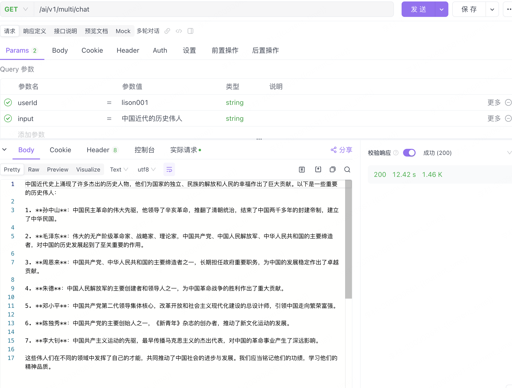
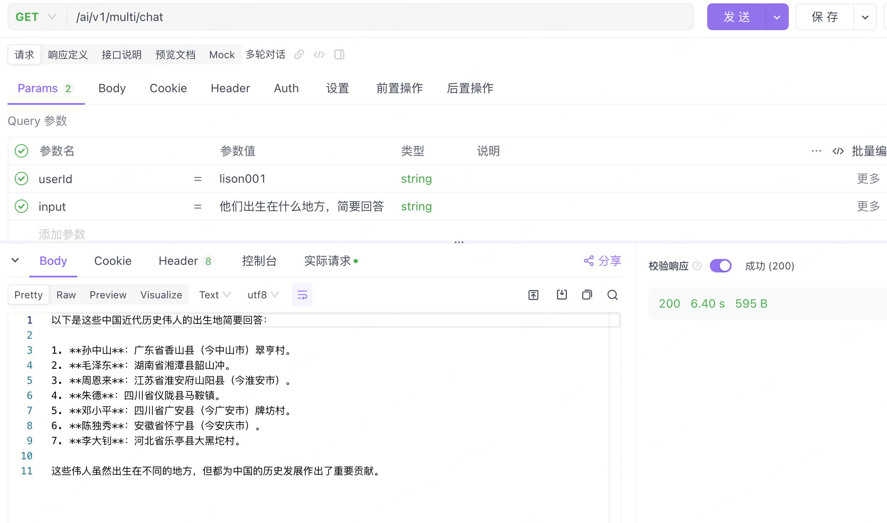
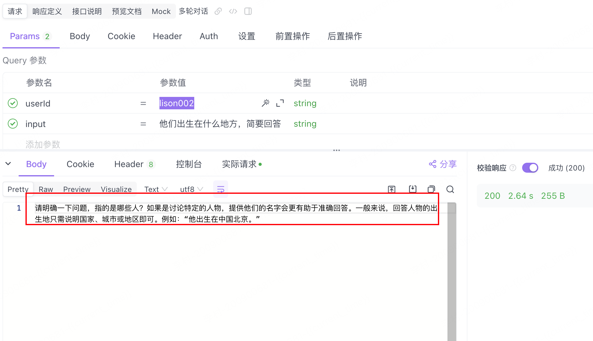
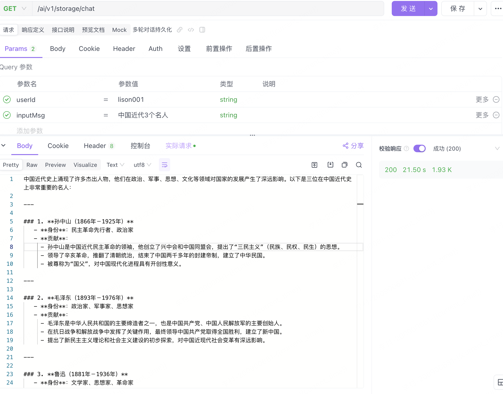
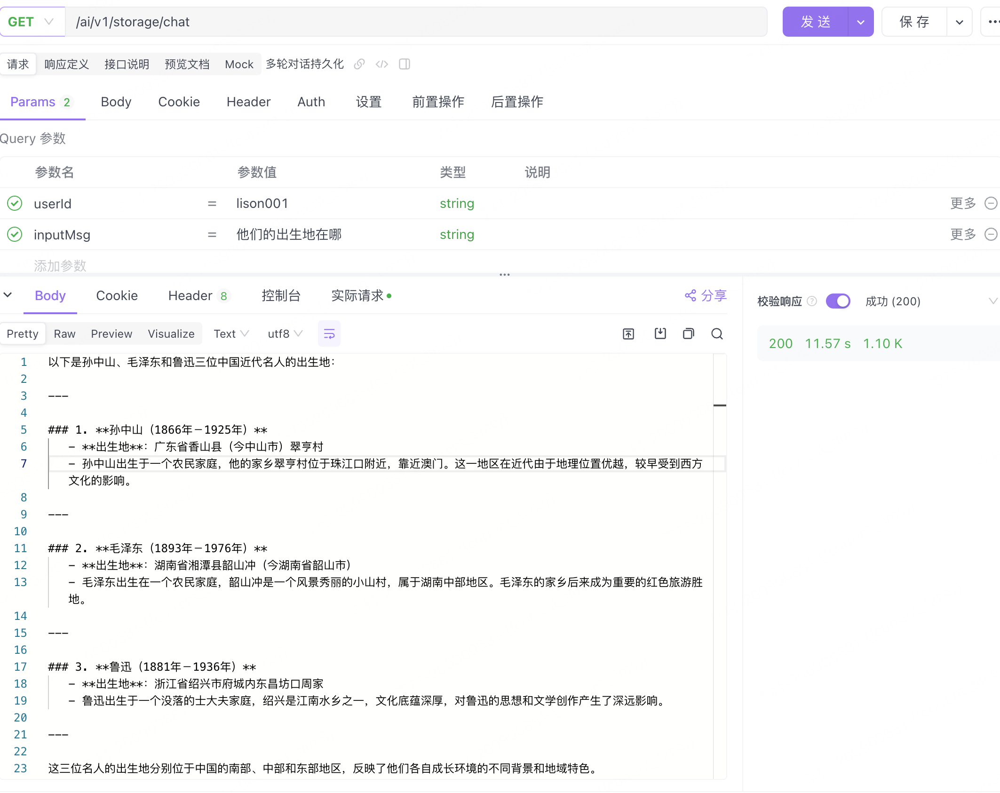
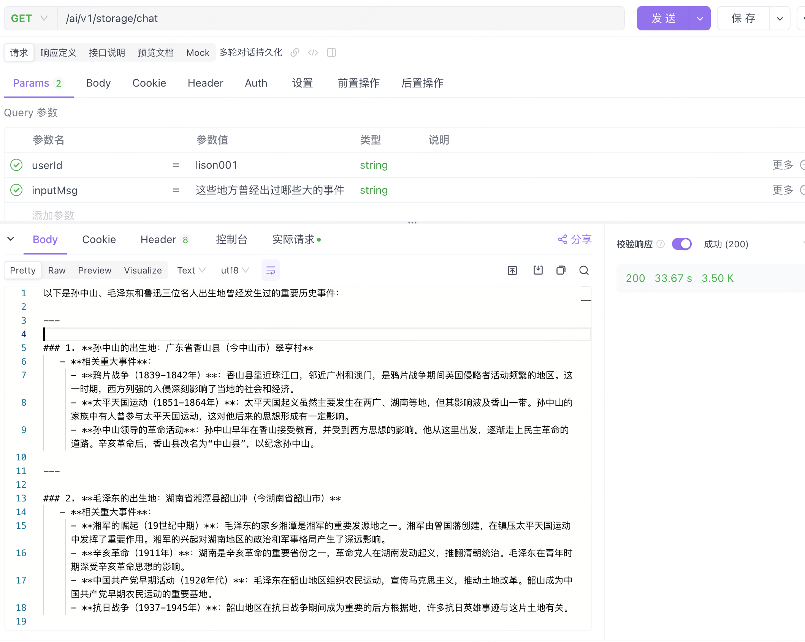
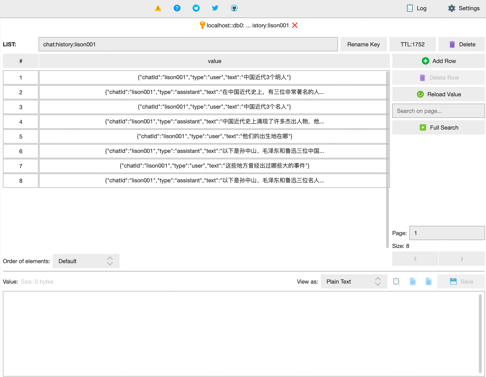

Spring AI Alibaba-02-多轮对话记忆、持久化消息记录

# Spring AI Alibaba-02-多轮对话记忆、持久化消息记录


`Lison `  `<dreamlison@163.com>`,  `v1.0.0`, `2025.04.19`

[toc]

本次主要聚焦于多轮对话功能的实现，后续会逐步增加更多实用内容，也欢迎大家提出宝贵意见，共同完善。

依赖：

- **开发工具**：IntelliJ IDEA（推荐使用最新版本，以获得更好的兼容性和功能支持）
- **JDK**：17 及以上版本（可利用 IDEA 自带的 JDK，安装便捷且配置简单）
- **阿里云百炼平台**：[阿里百炼平台](https://bailian.console.aliyun.com/)（提供强大的 AI 模型支持和训练服务）

## 多轮对话


**1、配置ChatMemory** 

```java
@Configuration
public class SpringAiChatConfig {


    /**
     * 创建一个基于内存的聊天模型
     */
    @Bean
    public ChatMemory chatMemory() {
        return new InMemoryChatMemory();
    }
}
```

**2、创建ChatMemoryController**

这里面注意这里可以设置用户ID等信息，咱们也就可以根据这个ID设置用户ID，以及会话ID，确保上下文连贯啦

~~~java
// 调用 chatClient.prompt() 方法开始构建聊天请求
ChatClient.CallResponseSpec response = chatClient.prompt()
        // 调用 .user(input) 方法，将用户输入作为聊天请求的内容
        .user(input)
        // 调用 .advisors 方法，传入一个 Lambda 表达式，配置聊天顾问的参数
        .advisors(spec -> spec.param(AbstractChatMemoryAdvisor.CHAT_MEMORY_CONVERSATION_ID_KEY, userId)
                // 继续在 Lambda 表达式中调用 .param 方法，设置聊天记忆的检索大小为 100
                .param(AbstractChatMemoryAdvisor.CHAT_MEMORY_RETRIEVE_SIZE_KEY, 100))
        // 调用 .call() 方法执行聊天请求并获取响应规格
        .call();

~~~


全文：

~~~java
package com.lison.ai.spring_ai_alibaba_demo.controller;


import lombok.extern.slf4j.Slf4j;
import org.springframework.ai.chat.client.ChatClient;
import org.springframework.ai.chat.client.advisor.AbstractChatMemoryAdvisor;
import org.springframework.ai.chat.client.advisor.MessageChatMemoryAdvisor;
import org.springframework.ai.chat.memory.ChatMemory;
import org.springframework.ai.chat.model.ChatModel;
import org.springframework.web.bind.annotation.RequestMapping;
import org.springframework.web.bind.annotation.RequestParam;
import org.springframework.web.bind.annotation.RestController;

@Slf4j
@RestController
@RequestMapping("/ai/v1")
public class ChatMemoryController {
    private final ChatClient chatClient;

    // 构造器中注入 ChatModel（底层与 AI 模型交互）和 ChatMemory（对话记忆实现）
    public ChatMemoryController(ChatModel chatModel, ChatMemory chatMemory) {
        // 使用 ChatClient.Builder 构建 ChatClient，同时加入对话记忆 Advisor
        this.chatClient = ChatClient.builder(chatModel)
                .defaultAdvisors(new MessageChatMemoryAdvisor(chatMemory))
                .build();
    }

    /**
     * 多轮对话接口
     * 每次调用时自动加载和更新该会话的历史记录。
     */
    @GetMapping("/multi/chat")
    public String chat(@RequestParam(value = "userId",defaultValue = "10001") String userId,
                       @RequestParam("input") String input) {
        log.info("/multi/chat   input:  [{}]", input);
        // 调用 chatClient.prompt() 方法开始构建聊天请求
        ChatClient.CallResponseSpec response = chatClient.prompt()
                // 调用 .user(input) 方法，将用户输入作为聊天请求的内容
                .user(input)
                // 调用 .advisors 方法，传入一个 Lambda 表达式，配置聊天顾问的参数
                .advisors(spec -> spec.param(AbstractChatMemoryAdvisor.CHAT_MEMORY_CONVERSATION_ID_KEY, userId)
                        // 继续在 Lambda 表达式中调用 .param 方法，设置聊天记忆的检索大小为 100
                        .param(AbstractChatMemoryAdvisor.CHAT_MEMORY_RETRIEVE_SIZE_KEY, 100))
                // 调用 .call() 方法执行聊天请求并获取响应规格
                .call();
        return response.content();
    }
}


~~~


通过以上代码，我们成功创建了一个对外接口：http://127.0.0.1:8080/ai/v1/multi/chat。该接口接受两个参数：

userId：代表用户 ID，在实际项目中，建议将其设置为用户 ID 与会话 ID 的组合，以便更精准地区分不同用户的对话。
input：用户输入的问题或消息。




测试连续对话，继续问他们出生在什么地方




**修改用户ID**

修改用户ID 继续询问问题 lison002，看是否能够继续作答




结果显示，AI 并未出现“串线”现象，对于新用户的提问，它无法获取之前用户的对话信息，只能要求我们提供更详细的资料，这证明了我们的多轮对话系统在不同用户间是相互独立且安全的。


## 对话持久-Redis


**增加依赖**

```
<dependency>
    <groupId>org.springframework.boot</groupId>
    <artifactId>spring-boot-starter-data-redis</artifactId>
</dependency>
```


**Redis配置类（RedisConfig.java）**

~~~java
package com.lison.ai.spring_ai_alibaba_demo.config;


import org.springframework.context.annotation.Bean;
import org.springframework.context.annotation.Configuration;
import org.springframework.data.redis.connection.RedisConnectionFactory;
import org.springframework.data.redis.core.RedisTemplate;
import org.springframework.data.redis.serializer.Jackson2JsonRedisSerializer;
import org.springframework.data.redis.serializer.StringRedisSerializer;


@Configuration
public class RedisConfig {
    @Bean
    public RedisTemplate<String, Object> redisTemplate(RedisConnectionFactory factory) {
        RedisTemplate<String, Object> redisTemplate = new RedisTemplate<>();
        redisTemplate.setConnectionFactory(factory);
        redisTemplate.setKeySerializer(new StringRedisSerializer());
        redisTemplate.setValueSerializer(new Jackson2JsonRedisSerializer<>(Object.class));
        redisTemplate.setHashKeySerializer(new StringRedisSerializer());
        redisTemplate.setHashValueSerializer(new Jackson2JsonRedisSerializer<>(Object.class));
        redisTemplate.afterPropertiesSet();
        return redisTemplate;
    }
}

~~~

>
>
>配置了 RedisTemplate，使用 JSON 序列化器将对象存储为 JSON 格式，方便后续的存储和读取。


**创建消息实体（ChatEntity.java）**


~~~java
package com.lison.ai.spring_ai_alibaba_demo.config;


import lombok.AllArgsConstructor;
import lombok.Data;
import lombok.NoArgsConstructor;

import java.io.Serializable;

@NoArgsConstructor
@AllArgsConstructor
@Data
public class ChatEntity implements Serializable {
    String chatId;
    String type;
    String text;
}

~~~

>定义了消息实体类，用于存储对话的 ID、类型和内容，实现了序列化接口以便在 Redis 中存储。


**实现 Redis 聊天记忆模型（ChatStorageMemory.java）**

~~~java
package com.lison.ai.spring_ai_alibaba_demo.config.chat;


import com.fasterxml.jackson.databind.ObjectMapper;
import lombok.extern.slf4j.Slf4j;
import org.springframework.ai.chat.memory.ChatMemory;
import org.springframework.ai.chat.messages.*;
import org.springframework.stereotype.Component;
import org.springframework.data.redis.core.RedisTemplate;

import java.util.ArrayList;
import java.util.Collections;
import java.util.List;
import java.util.concurrent.TimeUnit;

@Slf4j
@Component
public class ChatStorageMemory implements ChatMemory {

    private static final String KEY_PREFIX = "chat:history:";
    private final RedisTemplate<String, Object> redisTemplate;

    public ChatStorageMemory(RedisTemplate<String, Object> redisTemplate) {
        this.redisTemplate = redisTemplate;
    }

    @Override
    public void add(String conversationId, List<Message> messages) {
        String key = KEY_PREFIX + conversationId;
        List<ChatEntity> listIn = new ArrayList<>();
        for (Message msg : messages) {
            String[] strs = msg.getText().split("</think>");
            String text = strs.length == 2 ? strs[1] : strs[0];

            ChatEntity ent = new ChatEntity();
            ent.setChatId(conversationId);
            ent.setType(msg.getMessageType().getValue());
            ent.setText(text);
            listIn.add(ent);
        }
        redisTemplate.opsForList().rightPushAll(key, listIn.toArray());
        redisTemplate.expire(key, 30, TimeUnit.MINUTES);
    }

    @Override
    public List<Message> get(String conversationId, int lastN) {
        String key = KEY_PREFIX + conversationId;
        Long size = redisTemplate.opsForList().size(key);
        if (size == null || size == 0) {
            return Collections.emptyList();
        }

        int start = Math.max(0, (int) (size - lastN));
        List<Object> listTmp = redisTemplate.opsForList().range(key, start, -1);
        List<Message> listOut = new ArrayList<>();
        ObjectMapper objectMapper = new ObjectMapper();
        for (Object obj : listTmp) {
            ChatEntity chat = objectMapper.convertValue(obj, ChatEntity.class);
            if (MessageType.USER.getValue().equals(chat.getType())) {
                listOut.add(new UserMessage(chat.getText()));
            } else if (MessageType.ASSISTANT.getValue().equals(chat.getType())) {
                listOut.add(new AssistantMessage(chat.getText()));
            } else if (MessageType.SYSTEM.getValue().equals(chat.getType())) {
                listOut.add(new SystemMessage(chat.getText()));
            }
        }
        return listOut;
    }

    @Override
    public void clear(String conversationId) {
        redisTemplate.delete(KEY_PREFIX + conversationId);
    }
}


~~~

实现了 Redis 中的对话记忆功能，包括添加对话、获取对话历史和清除对话记录。


 **SpringAiChatConfig 注入类**


~~~java
package com.lison.ai.spring_ai_alibaba_demo.config.chat;


import org.springframework.ai.chat.client.ChatClient;
import org.springframework.ai.chat.memory.ChatMemory;
import org.springframework.ai.chat.memory.InMemoryChatMemory;
import org.springframework.ai.chat.model.ChatModel;
import org.springframework.beans.factory.annotation.Autowired;
import org.springframework.context.annotation.Bean;
import org.springframework.context.annotation.Configuration;
import org.springframework.data.redis.core.RedisTemplate;

@Configuration
public class SpringAiChatConfig {


    @Autowired
    private ChatModel chatModel;

    @Bean
    public ChatClient chatClient(ChatMemory chatMemory) {
        return ChatClient.builder(chatModel)
                .build();
    }

    @Bean
    public ChatMemory chatMemory(RedisTemplate<String, Object> redisTemplate) {
        return new ChatStorageMemory(redisTemplate);
    }
}

~~~

通过 Spring 的依赖注入机制，将 Redis 聊天记忆模型与 ChatClient 进行绑定，确保对话记忆功能能够正常工作。

**编写核心控制器（ChatStorageMemoryController.java）**

~~~java
package com.lison.ai.spring_ai_alibaba_demo.controller;


import lombok.extern.slf4j.Slf4j;
import org.springframework.ai.chat.client.ChatClient;
import org.springframework.ai.chat.client.advisor.MessageChatMemoryAdvisor;
import org.springframework.ai.chat.memory.ChatMemory;
import org.springframework.beans.factory.annotation.Autowired;
import org.springframework.web.bind.annotation.GetMapping;
import org.springframework.web.bind.annotation.RequestMapping;
import org.springframework.web.bind.annotation.RequestParam;
import org.springframework.web.bind.annotation.RestController;


@Slf4j
@RestController
@RequestMapping("/ai/v1")
public class ChatStorageMemoryController {
    @Autowired
    private ChatClient chatClient;
    @Autowired
    private ChatMemory chatMemory;

    // 对话记忆长度
    private final Integer CHAT_HISTORY_SIZE = 10;

    @GetMapping(value = "/storage/chat")
    public String chat(@RequestParam String userId, @RequestParam String inputMsg) {

        log.info("/redis/chat  userId: [{}],  input:  [{}]", userId, inputMsg);

        String text = chatClient.prompt()
                .user(inputMsg)
                .advisors(new MessageChatMemoryAdvisor(chatMemory, userId, CHAT_HISTORY_SIZE))
                .call()
                .content();
        log.info("text --> [{}]", text);
        return text;
    }
}

~~~


**application.yml**

~~~yaml
server:
  port: 8080
spring:
  application:
    name: AI Demo
  data:
    redis:
      host: 127.0.0.1
      port: 6379
      password: xxxx
      database: 0
  ai:
    dashscope:
      api-key: sk-xxxx


~~~


**验证测试**

http://localhost:8080/ai/v1/storage/chat?userId=lison001&inputMsg=中国近代3个名人

**第一轮对话：**中国近代3个名人



**第二轮对话：他们的出生地在哪**




**第三轮对话：这些地方曾经出过哪些大的事件**




 **Redis 的存储**



本次分享“可持久化的多轮对话”，以 Redis 为示例，实现对话记录的长期保存。当然，这一功能也可以拓展至数据库等其他存储方式。