# Spring AI Alibaba-03- Spring AI + DeepSeek-R1 +  ES/Milvus + RAG 智能对话应用开发全流程

在[人工智能]（AI）应用中，模型通常需要访问外部资源或执行特定操作，例如数据库查询、调用外部API或执行计算任务。**Spring AI**，作为Spring官方开源的[AI应用]开发框架，旨在简化将AI功能集成到应用程序的过程，避免不必要的复杂性，

[toc]

## Spring AI 中 Function Calling、Tool Calling 和 Agent 是什么关系

### Spring AI 介绍

#### Spring AI的版本演进

Spring AI自发布以来，经过了多个版本的迭代更新，每个版本都带来了新的特性和改进，以下是一些重要版本的发布情况：

* 2024年5月30日：发布了1.0.0 Milestone 1版本，标志着API的基本确定，功能逐步完善。
* 2024年8月23日：发布了1.0.0 Milestone 2版本，增强了可观察性功能，提高了监控和调试能力。
* 2024年10月8日：发布了1.0.0 Milestone 3版本，进一步扩展了对多种AI模型的支持。
* 2024年11月20日：发布了1.0.0 Milestone 4版本，加入了对Amazon Bedrock Converse API的支持，提升了与Amazon模型的兼容性。
* 2025年2月14日：发布了1.0.0 Milestone 6版本，带来了多项新特性和改进，进一步巩固了框架的稳定性

#### Spring AI的主要功能

Spring AI为开发者提供了多种AI功能的支持，包括：

* 智能聊天：集成大型语言模型（LLM），实现自然语言处理和对话生成。
* 文本生成：利用AI模型生成创意文本内容，例如文章、故事等。
* 图像生成：通过文本提示生成图像，支持多种图像生成模型。
* 音频处理：实现语音转文本和文本转语音功能，增强应用的交互性。
* 功能调用：允许模型请求执行客户端工具和函数，以访问实时信息。

### **函数调用（Function Calling）**

#### 功能与作用

在AI应用中，模型常常需要访问外部资源或执行特定操作（如数据库查询、调用API等）。函数调用功能允许AI模型在生成响应时，调用预定义的外部函数或服务，以获取模型无法直接生成的信息。举个例子，模型可以通过调用天气查询函数，获取实时天气数据。

#### 实现方式

在Spring AI中，函数调用的实现步骤如下：

**1、定义函数**：开发者创建一个实现`Function`接口的Java类，明确函数的输入输出类型。例如，定义一个获取天气信息的函数：

~~~java
@Component
public class WeatherFunction implements Function<WeatherFunction.WeatherRequest, String> {
    @Override
    public String apply(WeatherRequest request) {
        return "The weather in " + request.getCity() + " is sunny.";
    }
    public static class WeatherRequest {
        private String city;
        public String getCity() { return city; }
        public void setCity(String city) { this.city = city; }
    }
}

~~~

**2、注册函数**：将函数注册为Spring Bean，使其能被Spring AI识别和调用

~~~java
@Configuration
public class FunctionConfig {
    @Bean
    @Description("获取指定城市的天气信息")
    public Function<WeatherFunction.WeatherRequest, String> weatherFunction() {
        return new WeatherFunction();
    }
}
~~~

**3、配置模型**：在Spring AI的聊天客户端配置中，指定模型可以调用的函数：

~~~java
@Configuration
public class ChatConfig {
    @Autowired
    private ChatClient.Builder chatClientBuilder;

    @Bean
    public ChatClient chatClient() {
        return chatClientBuilder
                .withOptions(ChatOptions.builder().withFunction("weatherFunction").build())
                .build();
    }
}
~~~

**4、模型调用函数**：模型在生成响应时，可以通过请求调用外部函数，得到结果：

~~~java
@RestController
public class ChatController {
    @Autowired
    private ChatClient chatClient;

    @GetMapping("/chat")
    public String chat(@RequestParam String input) {
        WeatherFunction.WeatherRequest request = new WeatherFunction.WeatherRequest();
        request.setCity(input);
        String response = chatClient.prompt().user(input).functions("weatherFunction").call().content();
        return response;
    }
}
~~~

**注意**：需要注意的是，Spring AI中的函数调用功能已被弃用，建议使用**工具调用**（Tool Calling）来实现类似功能。

### **工具调用（Tool Calling）**

#### **功能与作用**

工具调用允许AI模型在生成响应时调用外部工具或服务。这些工具能够帮助模型获取实时数据、执行特定操作或增强其功能。例如，模型可以调用天气查询工具来获取实时天气信息，或调用计算工具进行复杂的数学运算。

#### 实现方式

工具调用的实现步骤与函数调用类似，但使用的是外部工具而非预定义的函数。以下是具体步骤：

**1、定义工具接口**：开发者定义一个接口，声明工具的方法：

~~~java
public interface WeatherTool {
    String getWeather(String city);
}
~~~

**2、实现工具接口**：编写具体的工具实现类，处理工具的业务逻辑：

~~~java
@Component
public class WeatherToolImpl implements WeatherTool {
    @Override
    public String getWeather(String city) {
        return "The weather in " + city + " is sunny.";
    }
}
~~~

**3、注册工具为Spring Bean**：将工具实现类注册为Spring Bean，以便Spring容器管理：

~~~java
@Configuration
public class ToolConfig {
    @Bean
    public WeatherTool weatherTool() {
        return new WeatherToolImpl();
    }
}
~~~

**4、配置模型使用工具**：在Spring AI配置中，指定模型使用的工具：

~~~java
@Configuration
public class ChatConfig {
    @Autowired
    private ChatClient.Builder chatClientBuilder;

    @Bean
    public ChatClient chatClient() {
        return chatClientBuilder
                .withOptions(ChatOptions.builder().withTool("weatherTool").build())
                .build();
    }
}

~~~

**5、模型调用工具**：模型在与用户交互时，通过工具调用获取所需的响应：

~~~java
@RestController
public class ChatController {
    @Autowired
    private ChatClient chatClient;

    @GetMapping("/chat")
    public String chat(@RequestParam String input) {
        String response = chatClient.prompt().user(input).tools("weatherTool").call().content();
        return response;
    }
}

~~~

### 智能体（Agent）

#### 功能与作用

智能体（Agent）是能够自主决策并采取行动的软件实体。不同于函数调用和工具调用，智能体不仅能够执行预定义的操作，还能够根据环境变化和任务需求，动态选择并调用适当的工具或服务来完成复杂任务。

#### 实现方式

智能体的实现涉及多个关键组件，主要包括：

模型上下文协议（MCP）：用于规范如何向大型语言模型（LLM）提供上下文信息。通过MCP，智能体可以与不同的数据源和工具交互，实现数据获取和处理。
智能体配置与实现：创建智能体并定义其行为。例如，可以创建一个与文件系统交互的智能体。
智能体与模型集成：在Spring AI配置中，定义智能体，并与AI模型进行集成，使其能够在生成响应时调用智能体的功能。
注意：在最新版本的Spring AI中，智能体功能已得到优化，建议开发者参考官方文档，了解最新实现方式和最佳实践。

### 从函数调用（FunctionCallbac）到工具调用（ToolCallback）

随着Spring AI的持续发展，函数调用（Function Callback）功能已被标记为过时（Deprecated），未来的趋势是采用工具调用（Tool Callback）机制。这种转变旨在提供更高的灵活性和扩展性，使开发者能够更方便地将外部工具和服务集成到AI应用中。

**为什么从FunctionCallback迁移到ToolCallback**

Spring AI团队决定将函数调用功能从FunctionCallback迁移到ToolCallback，主要基于以下考虑：

* 功能增强：ToolCallback提供了比FunctionCallback更丰富的功能，包括更灵活的工具定义和调用方式，使开发者能够更精确地控制工具的行为。
* 一致性和标准化：采用ToolCallback有助于统一工具调用的接口和规范，提升代码的可读性和维护性，减少因使用过时接口而可能引发的问题。
* 未来兼容性：由于FunctionCallback已被标记为过时，未来版本的Spring AI可能会移除对其的支持。为了确保应用的长期兼容性和稳定性，建议开发者尽早迁移至ToolCallback。

因此，Spring AI强烈建议开发者将现有的FunctionCallback实现迁移到ToolCallback，以充分利用新版本带来的改进和优势，确保应用的可维护性和可扩展性。

## Spring AI + DeepSeek-R1 + ES/Milvus + RAG + Tool Calling：智能对话应用开发

### 环境准备

- **操作系统**：Windows 11
- **Java 版本**：JDK 17+（请注意 Spring Boot 3.4.4 的兼容性）,Redis 、Elasticsearch、Milvus向量数据库
- **依赖管理**：Maven 3.8.3+
- **阿里云百炼平台**： [账号申请](https://bailian.console.aliyun.com/) 后，可以查看到以下模型的选择 [Deepseek接入](https://bailian.console.aliyun.com/?tab=api#/api/?type=model&url=https%3A%2F%2Fhelp.aliyun.com%2Fdocument_detail%2F2868565.html)

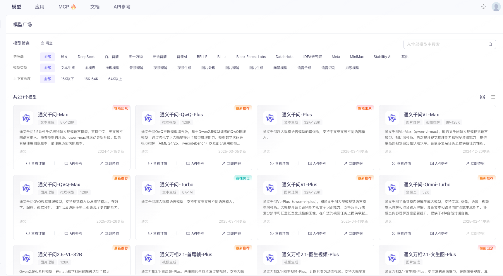

**Elasticsearch安装**

~~~yaml
# base 基础组件服务
version: '3.8'
services:
	elasticsearch1:
    image: docker.elastic.co/elasticsearch/elasticsearch:8.13.4
    hostname: "elasticsearch1"
    environment:
      - TZ=Asia/Shanghai
      - "ES_JAVA_OPTS=-Xms84m -Xmx512m"
    ports:
      - 9200:9200
      - 9300:9300
    volumes:
      - /Users/lison/work/data/dockerData/elasticsearch1/data:/usr/share/elasticsearch/data 
      - /Users/lison/work/data/dockerData/elasticsearch1/plugins:/usr/share/elasticsearch/plugins 
      - /Users/lison/work/data/dockerData/elasticsearch1/config:/usr/share/elasticsearch/config  
      - /Users/lison/work/data/dockerData/elasticsearch1/logs:/usr/share/elasticsearch/logs  
    privileged: true
    #restart: always
    networks:
      nt_dev:
        ipv4_address: 172.18.0.7

  vsftpd:
    image: "fauria/vsftpd"
    hostname: "rabbitmq1"
    environment:
      - FTP_USER=admin 
      - FTP_PASS=123456 
      - PASV_MIN_PORT=21100
      - PASV_MAX_PORT=21110 
      - PASV_ADDRESS=172.18.0.8
    ports:
      - 21:21
      - 21100-21110:21100-21110
    volumes:
      - /Users/lison/work/data/dockerData/vsftpd/file:/home/vsftpd
      - /Users/lison/work/data/dockerData/vsftpd/log/:/var/log/vsftpd
    privileged: true
    #restart: always
    networks:
      - nt_dev
~~~

~~~
docker compose up -d
~~~

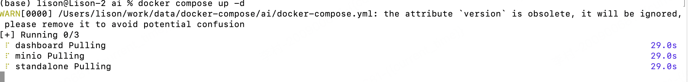

### 功能介绍

1. 集成 Spring AI 提供基础框架支持：Spring AI 作为对话系统开发的基础框架，提供了丰富的工具和库，帮助开发者快速搭建、训练和部署基于 AI 模型的应用程序，为整个项目提供了坚实的技术支撑。
2. 集成 Spring AI Alibaba，无缝对接阿里百炼平台：通过 Spring AI Alibaba，我们能够轻松调用阿里百炼平台提供的多种 AI 模型，包括高性能的大模型 DeepSeek-R1 和文本嵌入模型 text-embedding-v2。这些模型为对话系统提供了强大的生成能力和精准的向量表示能力。
3. 基于 Redis 实现记忆对话功能，并支持多种持久化方案：项目通过 Redis 实现了对话记忆功能，确保对话的连贯性和上下文一致性。同时，我们还提供了基于 Redis 的持久化方案，开发者可以根据需求灵活改造为 MySQL 持久化，或者采用 Redis + MySQL 的混合持久化方案，满足不同场景的需求。
4. 通过向量模型与 ElasticSearch 实现本地知识库功能（RAG 技术）：本项目采用阿里百炼平台提供的 text-embedding-v2 向量模型和 ElasticSearch 数据库，实现了本地知识库功能。通过 RAG 技术，系统能够从知识库中检索相关信息并融入对话生成过程。为了验证 RAG 的功能，我们通过工具生成了一份虚拟的医院介绍（“小智口腔医院”），以及 3 个科室介绍（“口腔修复科”、“口腔正畸科”、“儿童口腔科”）和 30 位医生的介绍。
5. Tool Calling：通过串联场景实现复杂任务的自动化：项目通过模拟以下三个场景，展示了 Tool Calling 技术如何串联整个技术栈的能力：
   * 场景 1：通过 RAG 找到医生后，进行挂号
   * 场景 2：挂号当日请假
   * 场景 3：挂号当日在医院附近找饭店

通过以上功能，本项目实现了从基础框架支持到复杂任务自动化的完整技术链条，包括 Spring AI + Spring AI Alibaba 调用阿里百炼平台、DeepSeek-R1 大模型、连续对话（Redis 实现）、RAG（向量模型 + ElasticSearch 实现）以及 Tool Calling（串联复杂场景）。这些技术的结合为开发者提供了一个强大的 AI 应用开发范例 

## 代码实现

**Maven 核心依赖**

~~~xml
<?xml version="1.0" encoding="UTF-8"?>
<project xmlns="http://maven.apache.org/POM/4.0.0" xmlns:xsi="http://www.w3.org/2001/XMLSchema-instance"
         xsi:schemaLocation="http://maven.apache.org/POM/4.0.0 https://maven.apache.org/xsd/maven-4.0.0.xsd">
    <modelVersion>4.0.0</modelVersion>
    <parent>
        <groupId>org.springframework.boot</groupId>
        <artifactId>spring-boot-starter-parent</artifactId>
        <version>3.4.3</version>
        <relativePath/> <!-- lookup parent from repository -->
    </parent>
    <groupId>com.lison.ai</groupId>
    <artifactId>spring_ai_alibaba_demo</artifactId>
    <version>0.0.1-SNAPSHOT</version>
    <name>spring_ai_alibaba_demo</name>
    <description>第一个 Spring AI Alibaba 项目</description>
    <properties>
        <java.version>23</java.version>
        <project.build.sourceEncoding>UTF-8</project.build.sourceEncoding>
        <project.reporting.outputEncoding>UTF-8</project.reporting.outputEncoding>
        <spring-boot.version>3.4.3</spring-boot.version>
        <spring-ai.version>1.0.0-M6</spring-ai.version>
        <alibaba.ai.version>1.0.0-M6.1</alibaba.ai.version>
        <spring.ai.ollama.version>1.0.0-M6</spring.ai.ollama.version>
    </properties>
    <dependencies>
        <dependency>
            <groupId>com.alibaba.cloud.ai</groupId>
            <artifactId>spring-ai-alibaba-starter</artifactId>
            <version>${alibaba.ai.version}</version>
        </dependency>

        <dependency>
            <groupId>org.springframework.ai</groupId>
            <artifactId>spring-ai-elasticsearch-store-spring-boot-starter</artifactId>
            <version>${spring-ai.version}</version>
        </dependency>

        <dependency>
            <groupId>org.springframework.boot</groupId>
            <artifactId>spring-boot-starter-web</artifactId>
        </dependency>
        <dependency>
            <groupId>org.springframework</groupId>
            <artifactId>spring-core</artifactId>
        </dependency>
        <dependency>
            <groupId>org.springframework</groupId>
            <artifactId>spring-beans</artifactId>
        </dependency>
        <dependency>
            <groupId>org.projectlombok</groupId>
            <artifactId>lombok</artifactId>
            <optional>true</optional>
        </dependency>
        <dependency>
            <groupId>org.springframework.boot</groupId>
            <artifactId>spring-boot-starter-data-redis</artifactId>
            <version>${spring-boot.version}</version>
        </dependency>
        <dependency>
            <groupId>org.springframework.boot</groupId>
            <artifactId>spring-boot-starter-test</artifactId>
            <scope>test</scope>
        </dependency>
    </dependencies>

    <repositories>
        <repository>
            <id>alimaven</id>
            <name>aliyun maven</name>
            <url>https://maven.aliyun.com/repository/public</url>
        </repository>
        <repository>
            <id>spring-milestones</id>
            <name>Spring Milestones</name>
            <url>https://repo.spring.io/milestone</url>
            <snapshots>
                <enabled>false</enabled>
            </snapshots>
        </repository>
        <repository>
            <id>spring-snapshots</id>
            <name>Spring Snapshots</name>
            <url>https://repo.spring.io/snapshot</url>
            <releases>
                <enabled>false</enabled>
            </releases>
        </repository>
    </repositories>

    <build>
        <plugins>
            <plugin>
                <groupId>org.apache.maven.plugins</groupId>
                <artifactId>maven-compiler-plugin</artifactId>
                <configuration>
                    <annotationProcessorPaths>
                        <path>
                            <groupId>org.projectlombok</groupId>
                            <artifactId>lombok</artifactId>
                            <version>1.18.36</version>
                        </path>
                    </annotationProcessorPaths>
                </configuration>
            </plugin>
            <plugin>
                <groupId>org.springframework.boot</groupId>
                <artifactId>spring-boot-maven-plugin</artifactId>
                <configuration>
                    <excludes>
                        <exclude>
                            <groupId>org.projectlombok</groupId>
                            <artifactId>lombok</artifactId>
                        </exclude>
                    </excludes>
                </configuration>
            </plugin>
        </plugins>
    </build>
</project>

~~~

上述配置文件中，我们引入了Spring Boot、Spring AI、Alibaba Cloud AI等核心依赖，确保项目能够顺利构建和运行。同时，通过配置Maven插件和仓库，优化项目的构建流程和依赖管理。

**核心配置 （`application.yml`）**

这里一定要注意的是文本推理模型 `model: deepseek-r1`, 嵌入模型`model: text-embedding-v2`用来生成文本的向量数据

~~~yaml
server:
  port: 8080
spring:
  application:
    name: AI Demo
  data:
    redis:
      host: 127.0.0.1
      port: 6379
      database: 0
  ai:
    dashscope:
      api-key: sk-xxxxx
      model: deepseek-r1
      embedding:
        options:
          model: text-embedding-v2
    vectorstore:
      elasticsearch:
        initialize-schema: true
        index-name: spring-ai-tag
        # 这里一定要注意，维度是默认1536，需要和向量模型的维度一致
        dimensions: 1536
        similarity: cosine
        batching-strategy: TOKEN_COUNT

~~~

在配置文件中，我们设置了服务器端口、Redis连接信息、Elasticsearch地址以及AI模型的相关参数。通过这些配置，项目能够正确连接到各个服务，并使用指定的模型进行对话处理和数据存储。 后面可以使用向量数据库进行存储

**Redis配置类（RedisConfig.java）**

~~~java
package com.lison.ai.spring_ai_alibaba_demo.config;

import org.springframework.context.annotation.Bean;
import org.springframework.context.annotation.Configuration;
import org.springframework.data.redis.connection.RedisConnectionFactory;
import org.springframework.data.redis.core.RedisTemplate;
import org.springframework.data.redis.serializer.Jackson2JsonRedisSerializer;
import org.springframework.data.redis.serializer.StringRedisSerializer;

@Configuration
public class RedisConfig {
    @Bean
    public RedisTemplate<String, Object> redisTemplate(RedisConnectionFactory factory) {
        RedisTemplate<String, Object> redisTemplate = new RedisTemplate<>();
        redisTemplate.setConnectionFactory(factory);
        redisTemplate.setKeySerializer(new StringRedisSerializer());
        redisTemplate.setValueSerializer(new Jackson2JsonRedisSerializer<>(Object.class));
        redisTemplate.setHashKeySerializer(new StringRedisSerializer());
        redisTemplate.setHashValueSerializer(new Jackson2JsonRedisSerializer<>(Object.class));
        redisTemplate.afterPropertiesSet();
        return redisTemplate;
    }
}

~~~

>
>
>配置了 RedisTemplate，使用 JSON 序列化器将对象存储为 JSON 格式，方便后续的存储和读取。

**创建消息实体（ChatEntity.java）**

~~~java
package com.lison.ai.spring_ai_alibaba_demo.config;

import lombok.AllArgsConstructor;
import lombok.Data;
import lombok.NoArgsConstructor;

import java.io.Serializable;

@NoArgsConstructor
@AllArgsConstructor
@Data
public class ChatEntity implements Serializable {
    String chatId;
    String type;
    String text;
}

~~~

>定义了消息实体类，用于存储对话的 ID、类型和内容，实现了序列化接口以便在 Redis 中存储。

**实现 Redis 聊天记忆模型（ChatStorageMemory.java）**

~~~java
package com.lison.ai.spring_ai_alibaba_demo.config.chat;

import com.fasterxml.jackson.databind.ObjectMapper;
import lombok.extern.slf4j.Slf4j;
import org.springframework.ai.chat.memory.ChatMemory;
import org.springframework.ai.chat.messages.*;
import org.springframework.stereotype.Component;
import org.springframework.data.redis.core.RedisTemplate;

import java.util.ArrayList;
import java.util.Collections;
import java.util.List;
import java.util.concurrent.TimeUnit;

@Slf4j
@Component
public class ChatStorageMemory implements ChatMemory {

    private static final String KEY_PREFIX = "chat:history:";
    private final RedisTemplate<String, Object> redisTemplate;

    public ChatStorageMemory(RedisTemplate<String, Object> redisTemplate) {
        this.redisTemplate = redisTemplate;
    }

    @Override
    public void add(String conversationId, List<Message> messages) {
        String key = KEY_PREFIX + conversationId;
        List<ChatEntity> listIn = new ArrayList<>();
        for (Message msg : messages) {
            String[] strs = msg.getText().split("</think>");
            String text = strs.length == 2 ? strs[1] : strs[0];

            ChatEntity ent = new ChatEntity();
            ent.setChatId(conversationId);
            ent.setType(msg.getMessageType().getValue());
            ent.setText(text);
            listIn.add(ent);
        }
        redisTemplate.opsForList().rightPushAll(key, listIn.toArray());
        redisTemplate.expire(key, 30, TimeUnit.MINUTES);
    }

    @Override
    public List<Message> get(String conversationId, int lastN) {
        String key = KEY_PREFIX + conversationId;
        Long size = redisTemplate.opsForList().size(key);
        if (size == null || size == 0) {
            return Collections.emptyList();
        }

        int start = Math.max(0, (int) (size - lastN));
        List<Object> listTmp = redisTemplate.opsForList().range(key, start, -1);
        List<Message> listOut = new ArrayList<>();
        ObjectMapper objectMapper = new ObjectMapper();
        for (Object obj : listTmp) {
            ChatEntity chat = objectMapper.convertValue(obj, ChatEntity.class);
            if (MessageType.USER.getValue().equals(chat.getType())) {
                listOut.add(new UserMessage(chat.getText()));
            } else if (MessageType.ASSISTANT.getValue().equals(chat.getType())) {
                listOut.add(new AssistantMessage(chat.getText()));
            } else if (MessageType.SYSTEM.getValue().equals(chat.getType())) {
                listOut.add(new SystemMessage(chat.getText()));
            }
        }
        return listOut;
    }

    @Override
    public void clear(String conversationId) {
        redisTemplate.delete(KEY_PREFIX + conversationId);
    }
}

~~~

实现了 Redis 中的对话记忆功能，包括添加对话、获取对话历史和清除对话记录。

 **SpringAiChatConfig 注入类**

~~~java
package com.lison.ai.spring_ai_alibaba_demo.config.chat;

import org.springframework.ai.chat.client.ChatClient;
import org.springframework.ai.chat.memory.ChatMemory;
import org.springframework.ai.chat.memory.InMemoryChatMemory;
import org.springframework.ai.chat.model.ChatModel;
import org.springframework.beans.factory.annotation.Autowired;
import org.springframework.context.annotation.Bean;
import org.springframework.context.annotation.Configuration;
import org.springframework.data.redis.core.RedisTemplate;

@Configuration
public class SpringAiChatConfig {

    @Autowired
    private ChatModel chatModel;

       @Bean
    public ChatClient chatClient(ChatMemory chatMemory) {
        return ChatClient.builder(chatModel)
                // 设置系统的默认行为和风格
                .defaultSystem("你是一个专业的助手，遇到不确定或不明确的信息时，会主动询问用户以获取更多信息。在回答问题时，你倾向于使用条理清晰的格式，例如分点列举的方式，以便用户更容易理解和参考。")
                // 注册向量检索顾问，用于从向量存储中检索相关信息
                .defaultAdvisors(
                        new QuestionAnswerAdvisor(
                                vectorStore,
                                SearchRequest.builder()
                                        .similarityThreshold(0.1) // 设置相似度阈值
                                        .topK(10) // 设置返回最多 10 条相关结果
                                        .build()
                        )
                )
                .build();
    }

    @Bean
    public ChatMemory chatMemory(RedisTemplate<String, Object> redisTemplate) {
        return new ChatStorageMemory(redisTemplate);
    }
}

~~~

**编写核心控制器（DeepseekChatController.java）**

~~~java
package com.lison.ai.spring_ai_alibaba_demo.controller;

import lombok.extern.slf4j.Slf4j;
import org.springframework.ai.chat.client.ChatClient;
import org.springframework.ai.chat.memory.ChatMemory;
import org.springframework.ai.chat.messages.Message;
import org.springframework.ai.document.Document;
import org.springframework.ai.document.DocumentReader;
import org.springframework.ai.rag.Query;
import org.springframework.ai.rag.preretrieval.query.transformation.CompressionQueryTransformer;
import org.springframework.ai.rag.preretrieval.query.transformation.QueryTransformer;
import org.springframework.ai.rag.preretrieval.query.transformation.RewriteQueryTransformer;
import org.springframework.ai.reader.TextReader;
import org.springframework.ai.vectorstore.SearchRequest;
import org.springframework.ai.vectorstore.VectorStore;
import org.springframework.beans.factory.annotation.Autowired;
import org.springframework.web.bind.annotation.GetMapping;
import org.springframework.web.bind.annotation.RequestMapping;
import org.springframework.web.bind.annotation.RequestParam;
import org.springframework.web.bind.annotation.RestController;

import java.io.IOException;
import java.util.ArrayList;
import java.util.List;

/**
 * @ClassName DeepseekChatController  //类名称
 * @Description:
 * @Author: 200900681 李村
 * @CreateDate: 2025/4/25
 * @Version: 1.0    //版本号
 */
@Slf4j
@RestController
@RequestMapping("/ai/v1")
public class DeepseekChatController {

    @Autowired
    private ChatClient chatClient;
    @Autowired
    private VectorStore vectorStore;
    @Autowired
    private ChatMemory chatMemory;
    // 对话记忆长度
    private final Integer CHAT_HISTORY_SIZE = 10;

    @GetMapping("/data/load")
    public String loadData() throws IOException {
        // 1. 读取文件
        DocumentReader reader = new TextReader("static/hospitalInfo.txt");
        List<Document> documents = reader.get();

        // 2.切分文件：根据空白行进行分割
        List<Document> splitDocuments =  new ArrayList<>();
        for (Document document : documents) {
            // 获取文档内容
            String content = document.getText();
            // 使用正则表达式按空白行分割
            String[] parts = content.split("\\n\\s*\\n");
            // 将分割后的部分封装为新的 Document 对象
            for (String part : parts) {
                splitDocuments.add(new Document(part.trim()));
            }
        }

        log.info("文件切分为 [{}]", splitDocuments.size());

        // 3.写入数据
        vectorStore.add(splitDocuments);

        return "success";
    }

    @GetMapping("/select")
    public String search(@RequestParam("query") String query) {
        log.info("query is  [{}]", query);
        List<Document> results = vectorStore.similaritySearch(
//                SearchRequest.builder().query(query).similarityThreshold(0.1).topK(10).build()
                SearchRequest.builder().query(query).similarityThreshold(0.1).topK(10).build()

        );
        log.info("results is [{}]", results);
        return results.toString();
    }

    /**
     * 查询重写
     * @param userId
     * @param inputMsg
     * @return
     */
    @GetMapping(value = "/rag/rewrite/chat", produces = "text/plain; charset=UTF-8")
    public String ragChatByRewrite(@RequestParam String userId, @RequestParam String inputMsg) {
        // 1、构建查询重写转换器
        QueryTransformer queryTransformer = RewriteQueryTransformer.builder()
                .chatClientBuilder(chatClient.mutate())
                .build();
        // 2、执行查询重写
        Query queryByTransform = queryTransformer.transform(new Query(inputMsg));
        // 3、输出重写后的查询文案
        return queryByTransform.text();
    }

    /**
     * 上下文感知查询
     * @param userId
     * @param inputMsg
     * @return
     */
    @GetMapping(value = "/rag/history/chat", produces = "text/plain; charset=UTF-8")
    public String ragChatByHistory(@RequestParam String userId, @RequestParam String inputMsg) {
        // 1. 获取历史消息
        List<Message> history = chatMemory.get(userId, CHAT_HISTORY_SIZE);
        // 2. 构建查询对象
        Query query = Query.builder()
                .text(inputMsg)
                .history(history)
                .build();

        // 3. 创建 CompressionQueryTransformer
        CompressionQueryTransformer queryTransformerByHis = CompressionQueryTransformer.builder()
                .chatClientBuilder(chatClient.mutate())
                .build();

        // 4、执行历史信息后查询
        Query queryByHistory = queryTransformerByHis.transform(query);

        // 5、输出重写后的查询文案
        return queryByHistory.text();
    }
    
}

~~~

**数据准备**

我让kimi帮我生成了一个医院的介绍，包含

- 医院`小智口腔医院`的介绍，
- 3个科室的介绍，分别是 `口腔修复科`,`口腔正畸科`,`儿童口腔科`
- 每个科室也有对应的20位医生信息

~~~
1. 医院介绍
小智口腔医院坐落在风景如画的苍云市，一所集临床、科研、教学、预防为一体的三级医院。医院是苍云市慈善医院、苍云市省老年友善医院、南阳市光荣院、南阳市牙病防治所所在地、南阳市中小学口腔保健教育基地。目前，医院已发展为“一院两区多门诊”，即两相路院区、光武路院区、新华路门诊、卧龙路门诊、关帝庙路门诊、工业路门诊等同步发展、同步运营、同质化服务的发展格局。两相路院区于2023年1月投入使用，建筑面积12.2万平米，规划床位1000张，口腔综合治疗台200台，耳鼻喉多功能治疗台20台，是以口腔、眼、耳鼻喉、整形美容为特色，内、外、妇、儿、中医、康复、肿瘤、放疗、体检等功能齐全的“大专科  小综合”三级医院。医院下设60个临床、医技科室，其中，口腔专业是苍云市省临床重点培育专科，耳鼻咽喉头颈外科是南阳市级临床重点专科。医院拥有计算机体层摄像系统、磁共振成像系统、彩色多普勒超声诊断仪、日本奥林巴斯NBI电子鼻咽喉镜、高清内窥镜摄像系统、全自动生化免疫流水线、口腔CBCT、多导睡眠诊断分析系统、日本奥林巴斯CV-290电子胃肠镜、眼科光学相干断层扫描仪OCT、蔡司700眼科手术显微镜、蔡司VisuMax SMILE 3.0微创全飞秒手术系统、CAD/CAM牙科扫描仪等先进设备。目前医院已开设内科、外科、妇产科、儿科、中医科、康复医学科、眼科、皮肤科、体检科、肿瘤放疗科、医养结合（无陪护康养）等综合医疗服务，先进的设备，优美的环境，精湛的技术，可满足患者优质医疗服务的需求。医院全体干部职工以“争创三级甲等口腔医院和省级区域性口腔医疗中心”为愿景，不断提高医疗技术和服务水平，更好地为人民群众提供更加安全、高效、高品质的口腔医疗保健服务和综合医疗服务。
2. 科室介绍
(1)口腔修复科:
口腔修复科是医院的核心科室之一，口腔修复科是‌专注于修复牙齿缺损、缺失，以及改善牙齿外观和功能的科室‌。主要通过人工修复体（如假牙、贴面、嵌体等）恢复牙齿的形态、咬合和美观，解决因龋齿、外伤、磨损或先天因素导致的牙齿问题，帮助患者重获正常的咀嚼、发音和笑容自信
(2)口腔正畸科:
是口腔科中专门负责治疗错𬌗畸形的部门。该科室主要收治因牙齿排列不齐、牙齿扭转错位、反𬌗、上颌前突、下颌后缩等牙颌面畸形问题前来就诊的患者。在专业范围上，科室通过运用矫治技术和设备，如固定矫治器、功能矫治器、隐形矫治器等，帮助患者恢复正常的牙齿排列和咬合关系，同时改善面部美观和口腔功能。在具体的科室设置上，口腔正畸科通常配备有专业的医护人员和先进的医疗设备，正畸专业医生多为本科毕业后教育，一般在本科阶段不涉及临床实习，都是在毕业后，通过研究生、进修或上级医师专业指导等方式获得正畸临床实践经验，确保患者能够得到全面、专业的治疗服务。
(3)儿童口腔科:
儿童口腔科是医院的新兴科室，提供儿童口腔疾病的预防与治疗，如龋齿、牙髓炎、牙周病等。我们还为儿童提供专门的牙科治疗设备和技术，以减轻他们的紧张情绪和疼痛感。

3. 医生介绍
(1) 李明轩
性别 ：男
出生年月 ：1985年3月
医生职称 ：副主任医师
所在科室 ：口腔修复科
毕业院校 ：本科毕业于“华西医科大学”，硕士毕业于“北京大学口腔医学院”，博士毕业于“上海交通大学医学院”。
介绍 ：李明轩医生是口腔修复科的骨干力量，临床经验丰富。他专注于复杂牙体修复和全瓷冠桥技术，熟练掌握数字化修复设备的应用。李医生多次参与国际学术交流，发表多篇高水平论文。他还积极参与社区义诊活动，普及口腔健康知识，为提高公众口腔保健意识做出了积极贡献。

(2) 王晓彤
性别 ：女
出生年月 ：1990年7月
医生职称 ：主治医师
所在科室 ：口腔正畸科
毕业院校 ：本科毕业于“中山大学光华口腔医学院”，硕士毕业于“复旦大学附属口腔医院”。
介绍 ：王晓彤医生是口腔正畸领域的新生力量，擅长儿童及成人错颌畸形的矫正治疗。她熟练掌握传统固定矫治器、隐形矫治器及功能性矫治器的应用，并注重个性化治疗方案的设计。王医生积极参与科研项目，发表了多篇关于正畸治疗效果的研究论文。她还多次参与社区公益活动，为青少年普及口腔健康知识。

(3) 张伟杰
性别 ：男
出生年月 ：1982年11月
医生职称 ：主任医师
所在科室 ：口腔修复科
毕业院校 ：本科毕业于“四川大学华西口腔医学院”，硕士毕业于“德国法兰克福大学”，博士毕业于“美国哈佛大学牙学院”。
介绍 ：张伟杰医生是口腔修复领域的权威专家，拥有丰富的临床经验。他专注于美学修复及咬合重建技术，尤其擅长复杂病例的综合设计与实施。张医生在国际学术界享有盛誉，曾多次受邀参加国际修复大会并作专题报告。他还致力于培养年轻医生，推动国内修复技术的发展。

(4) 陈静怡
性别 ：女
出生年月 ：1988年4月
医生职称 ：住院医师
所在科室 ：儿童口腔科
毕业院校 ：本科毕业于“武汉大学口腔医学院”，硕士毕业于“浙江大学医学院”。
介绍 ：陈静怡医生是儿童口腔科的新锐力量，专注于儿童龋病预防及早期干预。她熟练掌握乳牙及恒牙的治疗技术，并善于与孩子沟通，缓解他们的紧张情绪。陈医生积极参与科研工作，研究方向包括儿童口腔健康管理及行为引导策略。她还经常参与幼儿园及学校的口腔健康讲座，为家长和孩子普及护牙知识。

(5) 刘志远
性别 ：男
出生年月 ：1980年9月
医生职称 ：副主任医师
所在科室 ：口腔正畸科
毕业院校 ：本科毕业于“同济医科大学”，硕士毕业于“北京协和医学院”，博士毕业于“日本东京医科齿科大学”。
介绍 ：刘志远医生是口腔正畸领域的资深专家，擅长复杂错颌畸形的矫正治疗。他熟练掌握隐形矫治技术，并注重患者的舒适体验及术后效果。刘医生在国内外发表了多篇学术论文，研究成果受到同行高度认可。他还积极参与公益事业，为偏远地区患者提供免费咨询服务。

(6) 孙悦宁
性别 ：女
出生年月 ：1993年1月
医生职称 ：住院医师
所在科室 ：儿童口腔科
毕业院校 ：本科毕业于“武当医学学院”，硕士毕业于“青城医学研究所”，博士毕业于“昆仑医学大学”。
介绍 ：孙悦宁医生是儿童口腔科的新生力量，专业基础扎实。她专注于帮助儿童克服牙齿发育障碍，熟练掌握多种牙科评估工具和治疗方法。孙医生积极参与科室的科研工作，发表多篇学术论文。她多次参与社区义诊活动，普及儿童口腔健康知识，为提高公众健康意识做出了积极贡献。

(7) 赵天宇
性别 ：男
出生年月 ：1987年5月
医生职称 ：主治医师
所在科室 ：口腔修复科
毕业院校 ：本科毕业于“南京医科大学”，硕士毕业于“中国医科大学”。
介绍 ：赵天宇医生是口腔修复科的中坚力量，擅长全口义齿修复及种植修复技术。他注重美学设计，能够根据患者需求制定个性化的修复方案。赵医生积极参与学术交流，不断提升自身技术水平。他还通过线上科普视频，向患者普及修复相关知识。

(8) 林晓慧
性别 ：女
出生年月 ：1991年8月
医生职称 ：住院医师
所在科室 ：儿童口腔科
毕业院校 ：本科毕业于“山东大学口腔医学院”，硕士毕业于“西安交通大学医学院”。
介绍 ：林晓慧医生是儿童口腔科的新锐医生，专注于儿童龋病的早期诊断与治疗。她熟练掌握微创治疗技术，并善于用生动的方式与孩子互动。林医生积极参与科研项目，研究方向包括低龄儿童龋病的预防策略。她还通过社区活动，向家长普及儿童口腔护理知识。

(9) 黄志强
性别 ：男
出生年月 ：1979年12月
医生职称 ：主任医师
所在科室 ：口腔正畸科
毕业院校 ：本科毕业于“复旦大学医学院”，硕士毕业于“美国密歇根大学牙学院”。
介绍 ：黄志强医生是口腔正畸领域的权威专家，擅长复杂病例的矫正治疗。他熟练掌握隐形矫治技术，并注重患者的舒适体验及术后效果。黄医生在国内外发表了多篇学术论文，研究成果受到同行高度认可。他还积极参与公益事业，为偏远地区患者提供免费咨询服务

(10) 高雅婷
性别 ：女
出生年月 ：1986年2月
医生职称 ：主治医师
所在科室 ：口腔修复科
毕业院校 ：本科毕业于“首都医科大学”，硕士毕业于“北京大学口腔医学院”。
介绍 ：高雅婷医生是口腔修复科的中坚力量，擅长美学修复及咬合重建技术。她熟练掌握数字化修复设备的应用，并注重患者的个性化需求。高医生积极参与学术交流，不断提升自身技术水平。她还通过线上科普视频，向患者普及修复相关知识，帮助更多人了解牙齿健康的重要性。

(11) 王浩然
性别 ：男
出生年月 ：1983年7月
医生职称 ：副主任医师
所在科室 ：口腔正畸科
毕业院校 ：本科毕业于“浙江大学医学院”，硕士毕业于“英国伦敦大学学院牙学院”。
介绍 ：王浩然医生是口腔正畸领域的资深专家，擅长成人复杂错颌畸形的矫正治疗。他熟练掌握隐形矫治技术，并注重患者的舒适体验及术后效果。王医生在国内外发表了多篇学术论文，研究成果受到同行高度认可。他还积极参与公益事业，为偏远地区患者提供免费咨询服务。

(12) 李佳琪
性别 ：女
出生年月 ：1992年4月
医生职称 ：住院医师
所在科室 ：儿童口腔科
毕业院校 ：本科毕业于“天津医科大学”，硕士毕业于“南京大学医学院”。
介绍 ：李佳琪医生是儿童口腔科的新锐力量，专注于儿童龋病预防及早期干预。她熟练掌握乳牙及恒牙的治疗技术，并善于与孩子沟通，缓解他们的紧张情绪。李医生积极参与科研工作，研究方向包括儿童口腔健康管理及行为引导策略。她还经常参与幼儿园及学校的口腔健康讲座，为家长和孩子普及护牙知识。

(13) 周文博
性别 ：男
出生年月 ：1981年10月
医生职称 ：主任医师
所在科室 ：口腔修复科
毕业院校 ：本科毕业于“上海交通大学医学院”，硕士毕业于“德国慕尼黑大学牙学院”。
介绍 ：周文博医生是口腔修复领域的权威专家，拥有丰富的临床经验。他专注于复杂牙体修复及全口义齿修复技术，尤其擅长美学修复设计。周医生在国际学术界享有盛誉，曾多次受邀参加国际修复大会并作专题报告。他还致力于培养年轻医生，推动国内修复技术的发展。

(14) 张馨月
性别 ：女
出生年月 ：1989年6月
医生职称 ：主治医师
所在科室 ：口腔正畸科
毕业院校 ：本科毕业于“中山大学光华口腔医学院”，硕士毕业于“复旦大学附属口腔医院”。
介绍 ：张馨月医生是口腔正畸领域的新生力量，擅长儿童及成人错颌畸形的矫正治疗。她熟练掌握传统固定矫治器、隐形矫治器及功能性矫治器的应用，并注重个性化治疗方案的设计。张医生积极参与科研项目，发表了多篇关于正畸治疗效果的研究论文。她还多次参与社区公益活动，为青少年普及口腔健康知识。

(15) 王志鹏
性别 ：男
出生年月 ：1984年11月
医生职称 ：副主任医师
所在科室 ：口腔修复科
毕业院校 ：本科毕业于“华西医科大学”，硕士毕业于“北京大学口腔医学院”。
介绍 ：王志鹏医生是口腔修复科的骨干力量，擅长复杂牙体修复及种植修复技术。他熟练掌握显微修复技术，并注重患者的个性化需求。王医生多次参与国际学术交流，发表多篇高水平论文。他还积极参与社区义诊活动，普及口腔健康知识，为提高公众口腔保健意识做出了积极贡献。

(16) 赵雪梅
性别 ：女
出生年月 ：1990年3月
医生职称 ：住院医师
所在科室 ：儿童口腔科
毕业院校 ：本科毕业于“武汉大学口腔医学院”，硕士毕业于“浙江大学医学院”。
介绍 ：赵雪梅医生是儿童口腔科的新锐医生，专注于儿童龋病的早期诊断与治疗。她熟练掌握微创治疗技术，并善于用生动的方式与孩子互动。赵医生积极参与科研项目，研究方向包括低龄儿童龋病的预防策略。她还通过社区活动，向家长普及儿童口腔护理知识。

(17) 陈子豪
性别 ：男
出生年月 ：1988年9月
医生职称 ：主治医师
所在科室 ：口腔正畸科
毕业院校 ：本科毕业于“同济医科大学”，硕士毕业于“北京协和医学院”。
介绍 ：陈子豪医生是口腔正畸领域的资深专家，擅长复杂错颌畸形的矫正治疗。他熟练掌握隐形矫治技术，并注重患者的舒适体验及术后效果。陈医生在国内外发表了多篇学术论文，研究成果受到同行高度认可。他还积极参与公益事业，为偏远地区患者提供免费咨询服务。

(18) 李梦瑶
性别 ：女
出生年月 ：1994年1月
医生职称 ：住院医师
所在科室 ：儿童口腔科
毕业院校 ：本科毕业于“山东大学口腔医学院”，硕士毕业于“西安交通大学医学院”。
介绍 ：李梦瑶医生是儿童口腔科的新生力量，专业基础扎实。她专注于帮助儿童克服牙齿发育障碍，熟练掌握多种牙科评估工具和治疗方法。李医生积极参与科室的科研工作，发表多篇学术论文。她多次参与社区义诊活动，普及儿童口腔健康知识，为提高公众健康意识做出了积极贡献。

(19) 黄晓峰
性别 ：男
出生年月 ：1985年8月
医生职称 ：副主任医师
所在科室 ：口腔修复科
毕业院校 ：本科毕业于“南京医科大学”，硕士毕业于“中国医科大学”。
介绍 ：黄晓峰医生是口腔修复科的中坚力量，擅长全口义齿修复及种植修复技术。他注重美学设计，能够根据患者需求制定个性化的修复方案。黄医生积极参与学术交流，不断提升自身技术水平。他还通过线上科普视频，向患者普及修复相关知识。

(20) 刘欣怡
性别 ：女
出生年月 ：1991年5月
医生职称 ：主治医师
所在科室 ：口腔正畸科
毕业院校 ：本科毕业于“中山大学光华口腔医学院”，硕士毕业于“复旦大学附属口腔医院”。
介绍 ：刘欣怡医生是口腔正畸领域的新生力量，擅长儿童及成人错颌畸形的矫正治疗。她熟练掌握传统固定矫治器、隐形矫治器及功能性矫治器的应用，并注重个性化治疗方案的设计。刘医生积极参与科研项目，发表了多篇关于正畸治疗效果的研究论文。她还多次参与社区公益活动，为青少年普及口腔健康知识。
~~~

## 测试验证

~~~
数据写入的接口
http://127.0.0.1:8080/ai/v1/data/load
获取数据向量的接口
http://127.0.0.1:8080/ai/v1/select
连读对话的接口
http://127.0.0.1:8080/ai/v1/rag/chat
~~~

**数据写入**

>数据写入的接口
>http://127.0.0.1:8080/ai/v1/data/load

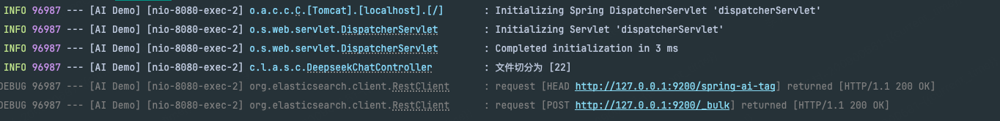

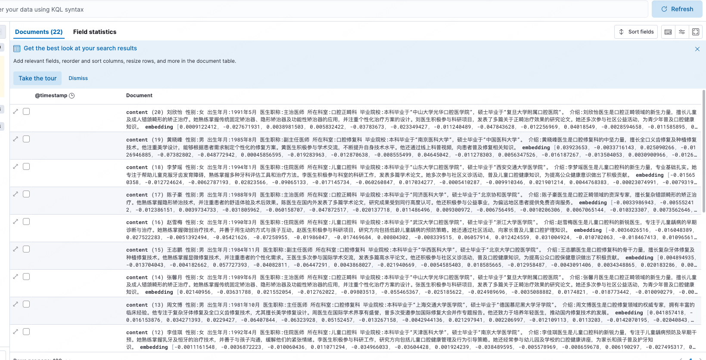

>获取数据向量的接口
>http://127.0.0.1:8080/ai/v1/select?query=医院介绍

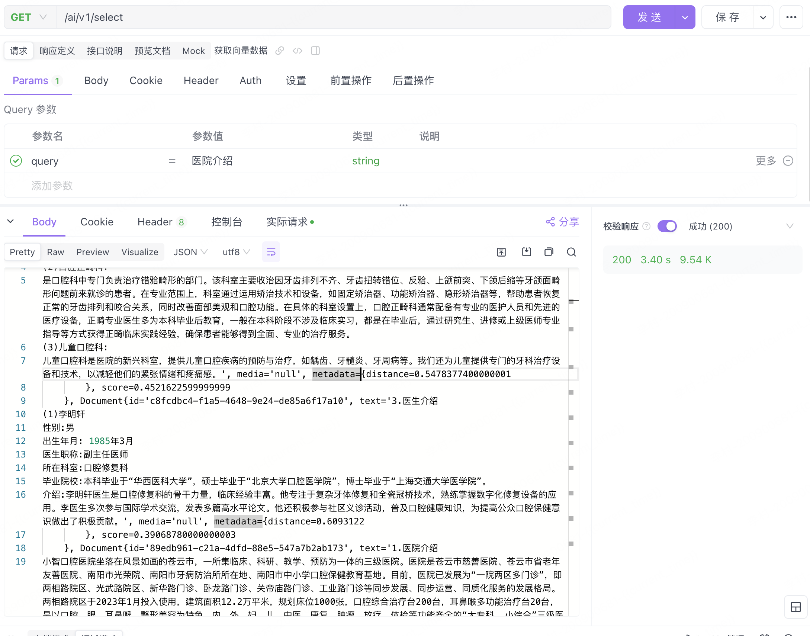

可以通过elasticsearch 搜索到医院信息，也就是这些信息会通过聊天接口上传给deepseek

接下来我们就准备验证RAG的能力，也就是检索+连续对话的能力了，我们设计了几个问题

>- 请介绍一下医院
>- 请介绍一下医院都有哪些科室
>- 医院有哪些主任医师
>- 张馨月医生怎么样
>- 我刚才都问了哪些问题

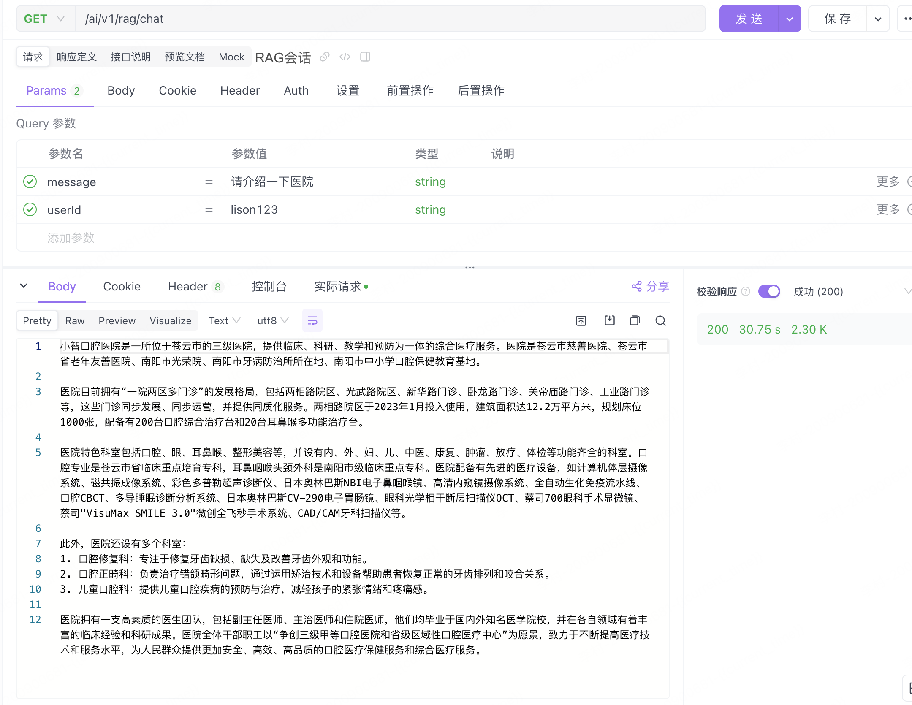

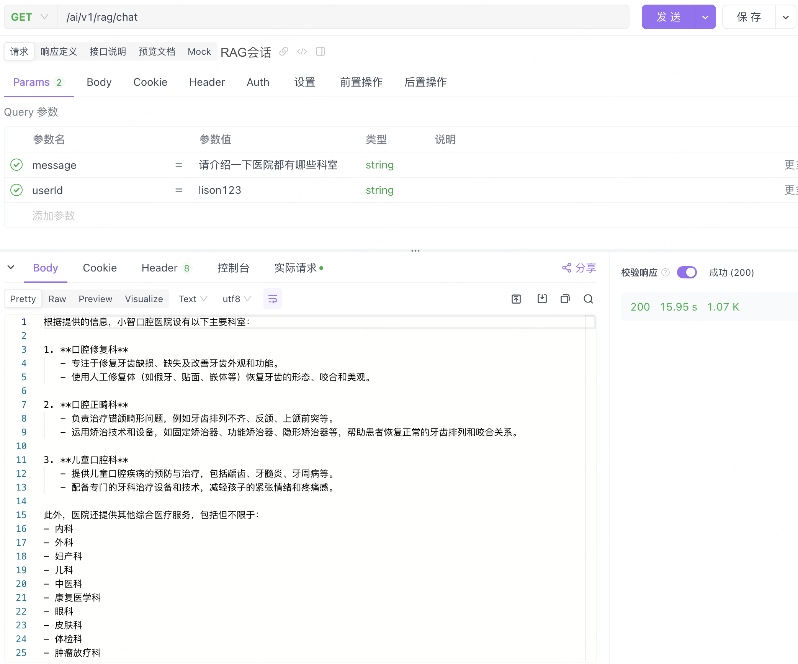

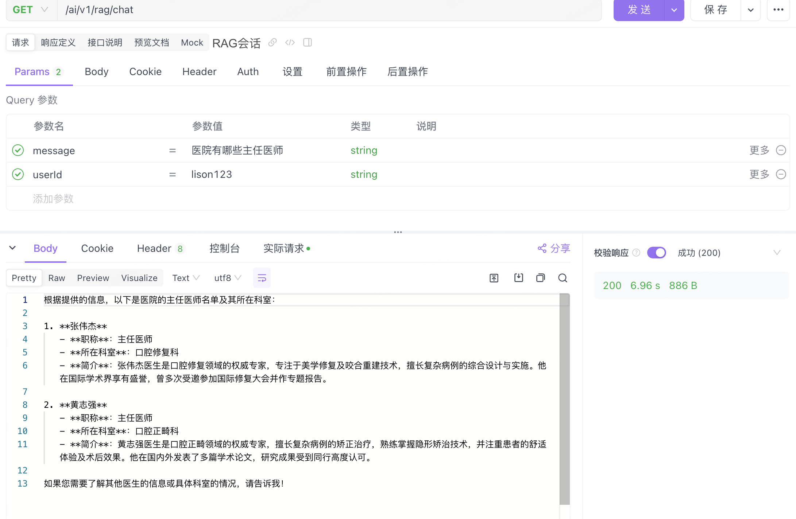

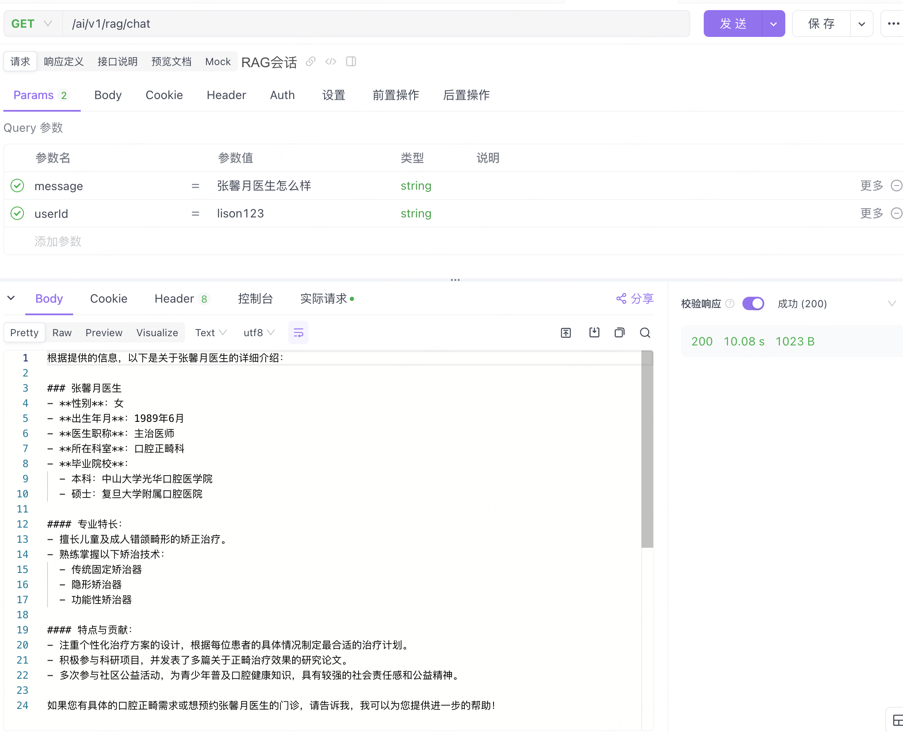

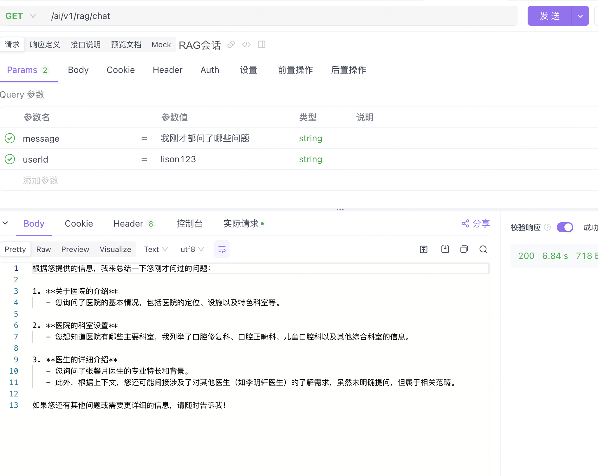

## 附：向量数据库milvus 存储数据

### Milvus安装

**Docker-compose 配置**

~~~yaml
# 配置 etcd 服务
  etcd:
    container_name: milvus-etcd  # 容器名称
    image: quay.io/coreos/etcd:v3.5.16  # 使用的镜像
    environment:
      - ETCD_AUTO_COMPACTION_MODE=revision  # 自动压缩模式
      - ETCD_AUTO_COMPACTION_RETENTION=1000  # 保留的修订版本数
      - ETCD_QUOTA_BACKEND_BYTES=4294967296  # 后端存储限制
      - ETCD_SNAPSHOT_COUNT=50000  # 快照计数
    volumes:
      - ${DOCKER_VOLUME_DIRECTORY:-.}/volumes/etcd:/etcd  # 数据卷挂载
    command: etcd -advertise-client-urls=http://127.0.0.1:2379 -listen-client-urls=http://0.0.0.0:2379 --data-dir /etcd  # 启动命令
    healthcheck:
      test: ["CMD", "etcdctl", "endpoint", "health"]  # 健康检查命令
      interval: 30s  # 检查间隔
      timeout: 20s  # 超时时间
      retries: 3  # 重试次数

  # 配置 MinIO 服务
  minio:
    container_name: milvus-minio  # 容器名称
    image: minio/minio:RELEASE.2023-03-20T20-16-18Z  # 使用的镜像
    environment:
      MINIO_ACCESS_KEY: minioadmin  # MinIO 访问密钥
      MINIO_SECRET_KEY: minioadmin  # MinIO 密钥
    ports:
      - "9001:9001"  # 控制台端口映射
      - "9000:9000"  # 服务端口映射
    volumes:
      - ${DOCKER_VOLUME_DIRECTORY:-.}/volumes/minio:/minio_data  # 数据卷挂载
    command: minio server /minio_data --console-address ":9001"  # 启动命令
    healthcheck:
      test: ["CMD", "curl", "-f", "http://localhost:9000/minio/health/live"]  # 健康检查命令
      interval: 30s  # 检查间隔
      timeout: 20s  # 超时时间
      retries: 3  # 重试次数
    networks:
      nt_dev:
        ipv4_address: 172.18.0.8   

  # 配置 Milvus 服务
  standalone:
    container_name: milvus-standalone  # 容器名称
    image: milvusdb/milvus:v2.5.4  # 使用的镜像
    command: ["milvus", "run", "standalone"]  # 启动命令
    security_opt:
    - seccomp:unconfined  # 安全选项
    environment:
      ETCD_ENDPOINTS: etcd:2379  # etcd 服务地址
      MINIO_ADDRESS: minio:9000  # MinIO 服务地址
    volumes:
      - ${DOCKER_VOLUME_DIRECTORY:-.}/volumes/milvus:/var/lib/milvus  # 数据卷挂载
    healthcheck:
      test: ["CMD", "curl", "-f", "http://localhost:9091/healthz"]  # 健康检查命令
      interval: 30s  # 检查间隔
      start_period: 90s  # 启动等待时间
      timeout: 20s  # 超时时间
      retries: 3  # 重试次数
    ports:
      - "19530:19530"  # 服务端口映射
      - "9091:9091"  # 管理端口映射
    depends_on:
      - "etcd"  # 依赖 etcd 服务
      - "minio"  # 依赖 MinIO 服务

  # 配置 Milvus Dashboard 服务
  dashboard:
    image: zilliz/attu:v2.5  # 使用的镜像
    container_name: milvus-dashboard  # 容器名称
    environment:
      MILVUS_URL: http://standalone:19530  # Milvus 服务地址
    ports:
      - "8000:3000"  # 端口映射
    depends_on:
      - standalone  # 依赖 Milvus 服务
      - etcd  # 依赖 etcd 服务
      - minio  # 依赖 MinIO 服务

# 定义网络配置
networks:
  nt_dev:
      external: true
~~~

~~~
docker compose up -d
~~~

**查看客户端，** 输入地址 `http://localhost:8000/`
进入如下界面：此时什么都不要填写，直接点【连接】按钮

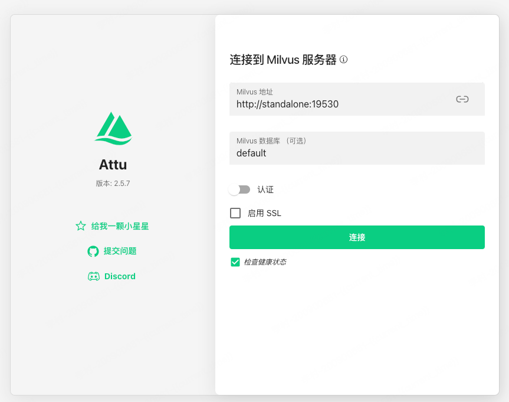

进入系统后

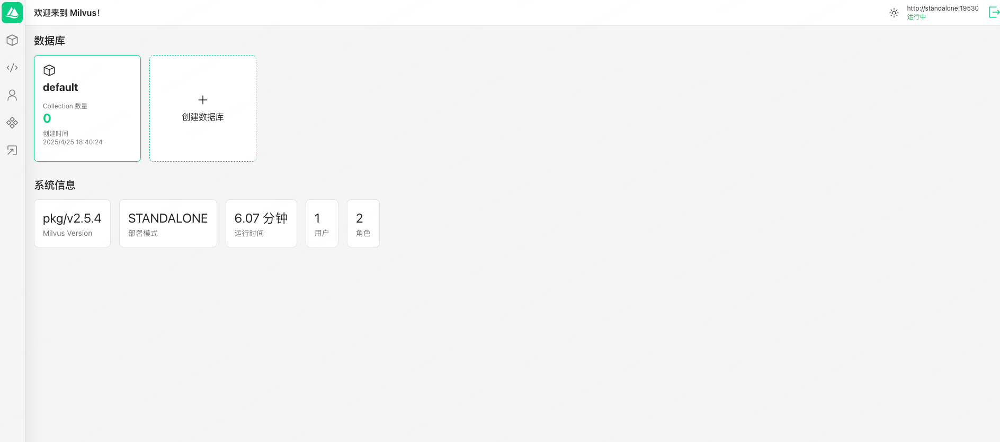

创建用户：用户名：``milvus`, 密码： `milvus-4321` (这里要和我们spring工程里的配置一致)，角色我们选 `admin`, 

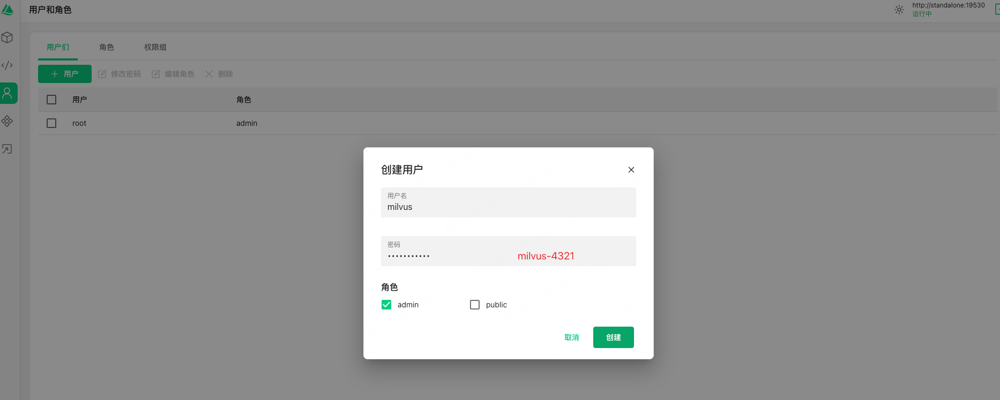

修改依赖：

~~~xml
  <dependency>
            <groupId>org.springframework.ai</groupId>
            <artifactId>spring-ai-milvus-store-spring-boot-starter</artifactId>
 </dependency>
~~~

修改配置

~~~yaml
server:
  port: 8080
spring:
  application:
    name: AI Demo
  data:
    redis:
      host: 127.0.0.1
      port: 6379
      database: 0
  elasticsearch:
    uris: http://127.0.0.1:9200
    username:
    password:
  ai:
    dashscope:
      api-key: sk-xxxx
      model: deepseek-r1
      embedding:
        options:
          model: text-embedding-v2
    vectorstore:
      milvus:
        client:
          host: "localhost"
          port: 19530
          username: "milvus"
          password: "milvus-4321"
        databaseName: "default"
        collectionName: "vector_store"
        embeddingDimension: 1536
        indexType: IVF_FLAT
        metricType: COSINE
        initialize-schema: true

~~~

在配置文件中，我们设置了服务器端口、Redis连接信息、Milvus地址以及AI模型的相关参数。通过这些配置，项目能够正确连接到各个服务，并使用指定的模型进行对话处理和数据存储。

使用加载接口

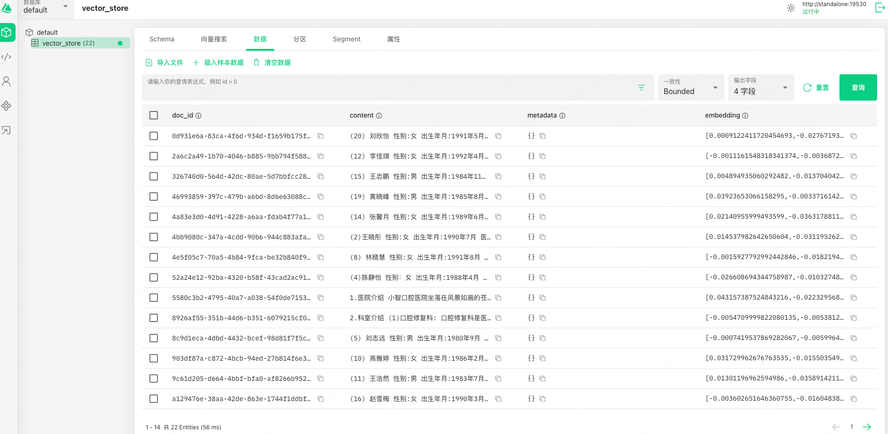
