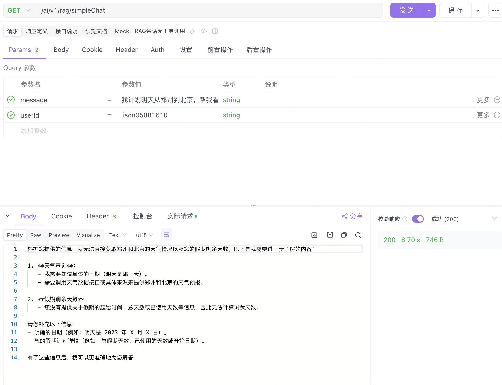
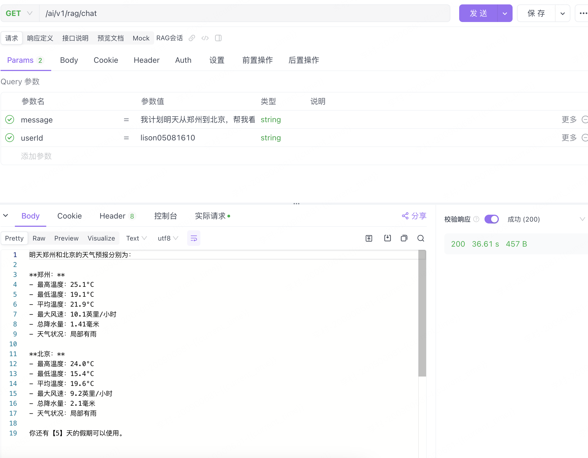
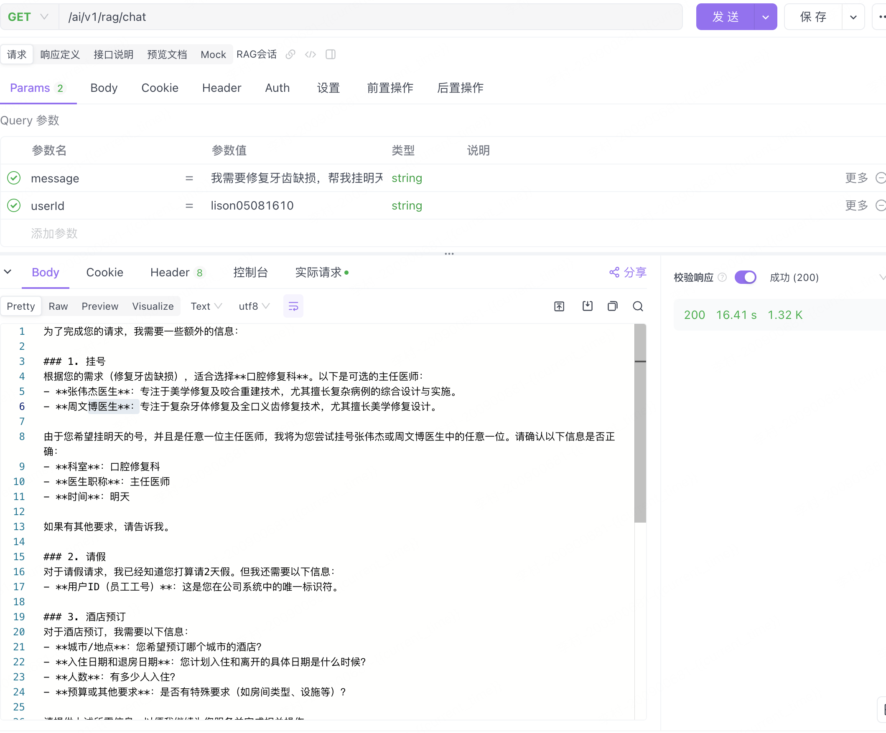

# Spring AI Alibaba-04- Spring AI + RAG + ToolCalling 智能对话应用开发全流程

[toc]

## 概述

### **Tool Calling 的核心优势在于：**

简化开发流程：通过统一的工具调用接口，开发者可以专注于业务逻辑，而无需处理繁琐的 HTTP 请求和响应解析。
增强扩展性：工具可以动态注册和调用，支持快速集成新服务。
提升用户体验：通过工具调用，应用可以实时获取外部数据（如天气、假期等），为用户提供了一个更智能、更全面的服务体验。
在本篇文章中，我们将通过一个具体的案例，展示如何使用 Spring AI 的 Tool Calling 功能来调用天气服务和 OA 服务，帮助开发者快速上手这一强大功能。

### 功能介绍

Spring AI 的 Tool Calling 提供了以下核心功能：

1. **工具注册与管理**：支持动态注册工具，并通过注解或配置文件定义工具的描述和参数。
2. **工具调用链**：通过方法链式调用，开发者可以轻松组合多个工具，实现复杂业务逻辑。

在本案例中，我们将实现以下功能：

- 调用外部天气 API，获取指定城市的天气预报。
- 调用内部 OA 服务，查询员工剩余假期和提交请假申请。
- 通过 RAG 找到医生后，进行挂号
- 挂号当日在医院附近找饭店
- 对比两种实现方式（无工具调用 vs 工具调用），展示 Tool Calling 的优势。

## 环境准备

- **操作系统**：Windows 11
- **Java 版本**：JDK 17+（请注意 Spring Boot 3.4.4 的兼容性）,Redis 、Elasticsearch、Milvus向量数据库
- **依赖管理**：Maven 3.8.3+
- **天气服务**：需要注册天气服务 API [账号申请](https://www.weatherapi.com/)
- **阿里云百炼平台**： [账号申请](https://bailian.console.aliyun.com/) 后，可以查看到以下模型的选择 [Deepseek接入](https://bailian.console.aliyun.com/?tab=api#/api/?type=model&url=https%3A%2F%2Fhelp.aliyun.com%2Fdocument_detail%2F2868565.html)

通过 Spring 的依赖注入机制，将 Redis 聊天记忆模型与 ChatClient 进行绑定，确保对话记忆功能能够正常工作。

**Tool calling 相关服务**

1. **医院挂号服务**

~~~java
package com.lison.ai.spring_ai_alibaba_demo.toolcalling;

import lombok.extern.slf4j.Slf4j;
import org.springframework.ai.tool.annotation.Tool;
import org.springframework.ai.tool.annotation.ToolParam;
import org.springframework.context.annotation.Description;

@Slf4j
@Description("医院挂号的功能")
public class HospitalService {

    @Tool(description = "挂号接口，帮患者在线挂号的接口")
    String registeInHos (@ToolParam(description = "医生名称", required = true) String docName,
                         @ToolParam(description = "时间", required = true) String time ,
                         @ToolParam(description = "病情描述", required = false) String desc,
                         @ToolParam(description = "患者ID") String userId) {

        String rtn1 = "好的，已经为您挂了【"+docName+"】医生的号，就诊时间【"+time+"】，人数为【"+desc+"】";
        String rtn2 = "抱歉，暂时无法为您挂到医生【"+docName+"】的号，请稍后再试";

        return System.currentTimeMillis() % 4 == 0 ? rtn2 : rtn1;
    }

}

~~~

2. 办公OA服务

~~~java
package com.lison.ai.spring_ai_alibaba_demo.toolcalling;

import lombok.extern.slf4j.Slf4j;
import org.apache.commons.lang3.StringUtils;
import org.springframework.ai.tool.annotation.Tool;
import org.springframework.ai.tool.annotation.ToolParam;
import org.springframework.context.annotation.Description;

@Slf4j
@Description("OA相关服务，主要用于假期查询和请假")
public class OaService {

    private static int LEFT_DAYS = 5;
    @Tool(description = "员工剩余假期查询：查询员工还有几天的假期可以请")
    public String getCurrentDateTime() {
        return "目前，你还有 【"+LEFT_DAYS+"】 天的假期可以使用";
    }

    @Tool(description = "员工请假，需要传用户id(userId),和需要请假的天数 (days)")
    String askForLeave(@ToolParam(description = "员工工号") String userId ,@ToolParam(description = "需要请假的天数") String days) {
        if(!StringUtils.isNumeric(days)){
            throw new IllegalArgumentException("days参数必须是数字");
        }
        int dayInt = Integer.parseInt(days);
        String rtn1 = "好的，员工【"+userId+"】,已经请假【"+days+"】天，请好好享受假期";
        String rtn2 = "你的假期不足，无法请假";
        return dayInt>=LEFT_DAYS?rtn2:rtn1;
    }
}

~~~

3. 饭店查询服务

~~~java
package com.lison.ai.spring_ai_alibaba_demo.toolcalling;

import lombok.extern.slf4j.Slf4j;
import org.springframework.ai.tool.annotation.Tool;
import org.springframework.ai.tool.annotation.ToolParam;
import org.springframework.context.annotation.Description;

import java.util.Set;

@Slf4j
@Description("饭店查询和预定服务")
public class RestaurantService {

    private static int LEFT_DAYS = 5;
    private static Set<String> RESTAURANT_NAME = Set.of( "红龙餐厅", "金莲小馆", "樱花寿司吧", "丝绸之路餐馆", "意大利小酒馆");

    @Tool(description = "查询不爱学习康复医院附近的饭店，餐厅，吃的，甜品，小吃")
    public String queryRestaurantName(@ToolParam(description = "当前位置", required = true) String location) {
        // 从 RESTAURANT_NAME 中随机选择
        String rtn = RESTAURANT_NAME.stream().skip((int) (Math.random() * RESTAURANT_NAME.size())).limit(3).reduce((a, b) -> a + "，" + b).get();
        return "当前位置" + location + "，推荐 restaurantName：" + rtn;
    }

    @Tool(description = "预定餐厅，需要提供饭店名称，时间和人数")
    String bookRestaurant (@ToolParam(description = "饭店名称", required = true) String restName,
                           @ToolParam(description = "订餐时间", required = true) String time ,
                           @ToolParam(description = "就餐人数", required = true) String userNumber) {
        String rtn1 = "好的，已经为您预定了【"+restName+"】，就餐时间为【"+time+"】，人数为【"+userNumber+"】";
        String rtn2 = "抱歉，暂时无法为您预定【"+restName+"】，请稍后再试";
        return System.currentTimeMillis() % 4 == 0 ? rtn2 : rtn1;
    }
}

~~~

 **控制器（ToolCallController.java）**

~~~
  @GetMapping(value = "/rag/chat", produces = "text/plain; charset=UTF-8")
    public String ragChat(@RequestParam String userId, @RequestParam String message) {
        log.info("userId -> [{}], message --> [{}]", userId, message);
        String text = chatClient.prompt()
                .user(message)
                .advisors(new MessageChatMemoryAdvisor(chatMemory,userId,100))
                .tools(new OaService(), new RestaurantService(),new HospitalService(),new WeatherService(webClient))
                .call().content();
        return text;
    }
~~~

## 测试验证

1、无工具调用

~~~
http://localhost:8080/ai/v1/rag/simpleChat?message=我计划明天从郑州到北京，帮我看一下这两个地方的天气，再帮我看一下我还剩几天假期，
~~~

响应结果：

**说明**：

- 无工具调用接口只能基于预设的逻辑进行简单回复，无法调用外部服务获取实时数据。
- 这种方式适合处理简单的聊天逻辑，但对于复杂需求（如实时天气查询和假期管理）显得力不从心

2、工具调用接口

~~~
http://localhost:8080/ai/v1/rag/chat?message=我计划明天从郑州到北京，帮我看一下这两个地方的天气，再帮我看一下我还剩几天假期，
~~~

继续调用

~~~
http://localhost:8080/ai/v1/rag/chat?message=我需要修复牙齿缺损，帮我挂明天任意一位主任医师的号，然后帮我请2天假，并定一天的酒店
~~~

**说明**：

- 工具调用接口通过调用天气服务和 OA 服务，能够提供更全面和准确的响应。
- 这种方式适合处理复杂的业务逻辑，但需要确保工具的稳定性和正确性

